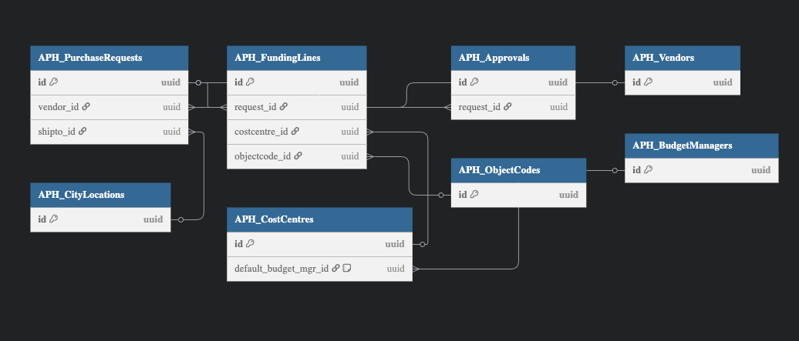
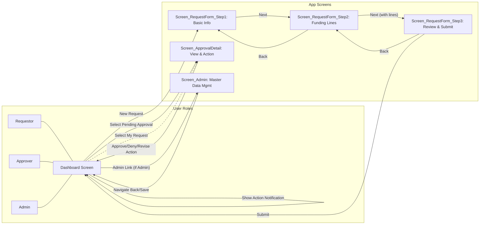
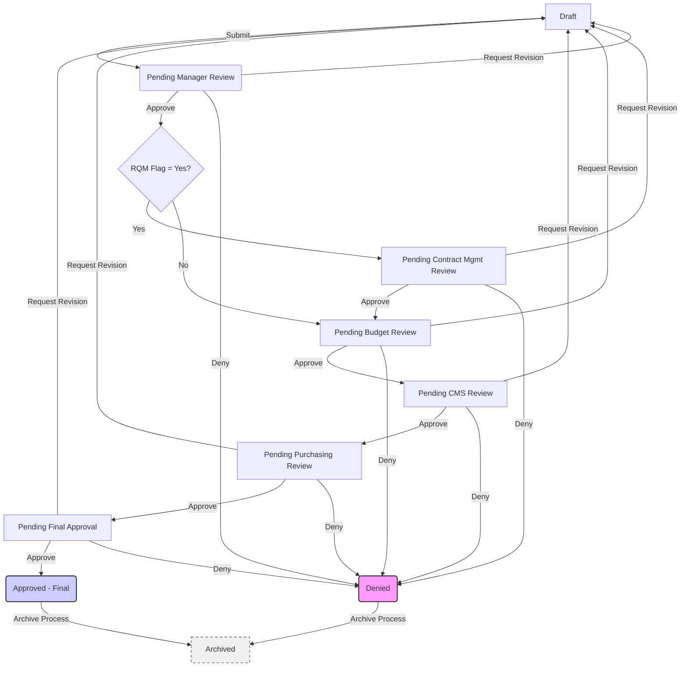
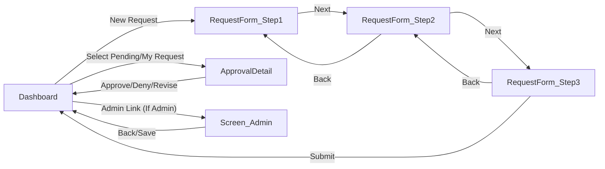

**APH - Developer Onboarding & Setup Guide**

*A step-by-step guide to configure your local environment, connect to the APH Purchasing Power App solution in Development, verify and align existing components, and initialize the Git repository with the current solution source code.*

**Goal:** To establish a consistent development environment, bring the existing solution components under version control, and prepare for ongoing feature development following best practices.

---

**1. Prerequisites & Tools**

Ensure you have the following tools installed and accessible before you begin:

| Tool                             | Purpose                                         | Install Instructions                                                                                         | Notes                               |
| :------------------------------- | :---------------------------------------------- | :----------------------------------------------------------------------------------------------------------- | :---------------------------------- |
| Node.js (Latest LTS)             | Required by some PAC CLI functionalities        | [https://nodejs.org](https://nodejs.org)                                                                        | Verify version with `node -v`     |
| Power Platform CLI (pac)         | Pack/unpack solutions, Canvas apps, admin tasks | Follow official guide:[Install PAC CLI](https://learn.microsoft.com/en-us/power-platform/developer/cli/install) | Use `pac install latest` or MSI   |
| PnP PowerShell                   | Extract/Apply SharePoint site structure         | From PS:`Install-Module PnP.PowerShell -Scope CurrentUser`                                                 | Requires PowerShell 7+              |
| Visual Studio Code               | Code editor                                     | [https://code.visualstudio.com](https://code.visualstudio.com)                                                  | Recommended IDE                     |
| Git                              | Version control                                 | [https://git-scm.com](https://git-scm.com)                                                                      | For version control setup         |
| Power Platform VS Code Extension | Canvas App (YAML) & PCF editing                 | In VS Code Marketplace: “Power Platform Tools”                                                             | Essential for Canvas development    |
| PowerShell 7+                    | Run PnP provisioning & other scripts            | [Install PowerShell](https://learn.microsoft.com/en-us/powershell/scripting/install/installing-powershell)      | Needed for modern PS features & PnP |

---

**2. Access & Permissions**

Confirm your user account has the necessary permissions. Request access if you don't have it:

1.  **Azure AD Groups:** Ensure your account is added to:
    *   `APH_Developers` (Grants Environment Maker role in Dev/Test)
    *   `APH_Requestors` (For submitting test requests within the app)
    *   *(Ask Admin/Lead if other groups are needed)*
2.  **SharePoint Site:** Request **Contribute** (or Full Control for Dev) access to the APH Purchasing Development SharePoint site: `https://aph.sharepoint.com/sites/APH-Purchasing` (Confirm URL with Admin/Lead).
3.  **Power Platform Environments:**
    *   **Dev:** Environment Maker role. URL: `https://aph-dev.crm.dynamics.com` (Confirm URL with Admin/Lead).
    *   **Test:** Environment Maker role (or specific testing role).
    *   **Prod:** Basic User / Run-only permissions (typically).
4.  **Git Repository Access:** Request **Write** access to the designated central Git repository for this project (e.g., `https://github.com/aphchrisc/aph-purchasing.git`). Confirm repository URL with Admin/Lead.
5.  **Service Accounts:** Be aware that deployed flows use connections authenticated via service accounts (e.g., `APH_SP_Connection`, `APH_O365_Outlook`). You typically won't need direct credentials, but understanding this is important for context.

---

**3. Understanding the Starting Point & Goal: Solution and Version Control**

*   **Current State:** Some components for the APH Purchasing solution may already exist in the **Dev Power Platform environment** and the **Dev SharePoint site**. However, these might not be fully aligned with the final documented specifications, and they likely aren't yet organized within a single Power Platform Solution or tracked in Git version control.
*   **The Goal:** Your primary goal is to:
    1.  Establish a formal Power Platform **Solution** named `APH_Purchasing` (or confirm/use the existing one).
    2.  Ensure the Canvas App and all Power Automate Flows are **solution-aware** (i.e., part of that Solution).
    3.  Verify, modify, and create SharePoint lists in the Dev site to **exactly match** the specifications in the "SharePoint List Structure Guide" document (provided separately).
    4.  Initialize the **Git repository** (`aph-purchasing`) with the *actual source code* of the solution (unpacked YAML, Flow JSON) and the *correct* SharePoint schema definition (PnP XML). This makes Git the single source of truth going forward.
*   **Git Repository:** The designated Git repository might currently be empty or contain conceptual examples. You will populate it with the real code from the Dev environment.
*   **Target Folder Structure (Once Initialized):** Your local Git repository should eventually look like this:

    ```
    aph-purchasing/                 <- Your main project folder
    ├─ .github/                   # (Optional) CI/CD workflows
    ├─ pnp/                       # PnP provisioning templates & scripts
    │   └─ APH_Purchasing_SiteTemplate.xml # Generated from *verified* Dev SP Site
    ├─ solutions/                 # Source code for Power Platform solutions
    │   └─ APH_Purchasing/          # Main solution folder (from export)
    │       ├─ src/                 # Unpacked source code lives here
    │       │   ├─ CanvasApps/      # Canvas App YAML source
    │       │   ├─ Workflows/       # Flow JSON definitions
    │       │   ├─ EnvironmentVariableDefinitions/
    │       │   └─ ... (Other component folders like ConnectionReferences)
    │       ├─ Solution.xml         # Solution definition files
    │       └─ customization.xml
    ├─ packages/                  # Stores exported solution .zip files (e.g., backups)
    ├─ scripts/                   # (Optional) Helper scripts
    └─ README.md                  # Project overview (Update this!)
    ```

---

**REVISED SECTION 4 of APH P - Developer Onboarding & Setup Guide**

---

**4. Initial Environment Setup, Solution Alignment, and **NEW** Repository Initialization**

Follow these steps carefully. This process aligns existing work with the documented standards, sets up **a new Git repository** for version control, and populates it with the actual solution source code from the Dev environment. **Do these steps in order.**

1.  **Create and Clone the **NEW** Git Repository:**
    *   **Action Required:** A **new, empty Git repository** needs to be created for this project on the designated platform (e.g., GitHub, Azure Repos). Coordinate with your Admin/Lead to:
        *   Get the repository created (e.g., named `aph-purchasing-solution`).
        *   Ensure you have **Write/Admin permissions** to this new repository.
        *   Get the **URL** of the new, empty repository.
    *   **Local Setup:**
        *   Open your preferred terminal (like Git Bash, PowerShell, or VS Code Terminal).
        *   Navigate (`cd`) to the directory where you want to store your development projects locally (e.g., `C:\Projects\`).
        *   Clone the **new, empty** repository using the URL provided:
            ```bash
            # Replace <new_repository_url> with the URL of the NEW repository
            git clone <new_repository_url> aph-purchasing
            ```
        *   Navigate into the newly cloned, empty directory:
            ```bash
            cd aph-purchasing
            ```
        *   *(The repository will be empty except possibly for a default README or .gitignore if created via the platform UI).*
2.  **Authenticate PAC CLI:** Connect the Power Platform CLI tool to the **APH Dev** environment.
    ```bash
    # Replace URL with the actual Dev environment URL if different
    pac auth create --name APH-Dev --url https://aph-dev.crm.dynamics.com --kind Dataverse
    pac auth select --name APH-Dev # Make sure APH-Dev is selected
    pac auth list # Verify APH-Dev is listed and marked with *
    ```
3.  **Verify/Create the Power Platform Solution:**
    *   Open a web browser and go to the Power Platform Maker Portal: `https://make.powerapps.com`.
    *   Select the **APH Dev** environment from the top-right environment picker.
    *   Navigate to **Solutions** on the left-hand menu.
    *   Look for an **unmanaged** solution named `APH_Purchasing`.
    *   **If the Solution Does NOT Exist:**
        *   Click **+ New solution**.
        *   **Display Name:** `APH Purchasing`
        *   **Name:** `APH_Purchasing` (This internal name is important)
        *   **Publisher:** Select the appropriate publisher with the `aph` prefix. **If none exists, STOP** and ask your Admin/Lead to create one first. Using the correct publisher is critical. Do **NOT** use the "(default)" publisher.
        *   **Version:** `1.0.0.0`
        *   Click **Create**. Wait for it to be created.
    *   **If the Solution DOES Exist:** Click on the existing `APH_Purchasing` unmanaged solution to open it. Ensure it's using the correct `aph` publisher.
4.  **Verify/Create Canvas App *within the Solution*:**
    *   While inside the `APH_Purchasing` solution in the Maker Portal:
    *   Look under the **Apps** section on the left. Check if the main Canvas App (e.g., `APH Purchasing App`) exists *here*.
    *   **If the App Does NOT Exist *within the solution*:**
        *   Click **+ New** > **App** > **Canvas app**.
        *   App name: `APH Purchasing App`. Format: **Tablet**. Click **Create**.
        *   **IMPORTANT:** Add a single Label, **Save** the app, and **Publish** it once. Close the studio. This creates the app asset within the solution.
    *   **If the App DOES Exist *within the solution*:** Confirm it's the correct app.
5.  **Verify/Add Flows *to the Solution*:**
    *   While inside the `APH_Purchasing` solution:
    *   Look under **Cloud flows**. Check if the core flows are listed here.
    *   **If Flows Exist BUT *Outside* this Solution:** Click **Add existing** > **Automation** > **Cloud flow**. Select the **From Dataverse** / 'Outside Solutions' tab. Find and add the relevant flows.
    *   **If Flows Do NOT Exist At All:** You will create them later (**+ New** > **Automation**...) *directly within this solution*.
    *   **If Flows DO Exist *within the solution*:** Confirm they are the correct flows.
6.  **Verify/Modify/Create SharePoint Lists:**
    *   **Goal:** Ensure SharePoint lists in Dev exactly match the "SharePoint List Structure Guide" document.
    *   Navigate to the **Dev SharePoint site** (`https://aph.sharepoint.com/sites/APH-Purchasing`).
    *   **Systematically go through EACH list defined in the guide:**
        *   **Check Existence:** Does the list exist?
        *   **If YES (Verify & Modify):** Go to **List settings**. **Meticulously compare and modify** every column (Name, Type, Internal Name, Required, Choices, Lookups, Indexing, Attachments) to **exactly match** the guide. Be careful changing types if data exists.
        *   **If NO (Create):** Click **+ New** > **List** > **Blank list**. Name it exactly. Go to **List settings**. **Add EACH column** precisely as defined in the guide. Enable Attachments/Indexing per the guide.
    *   **Result:** All required SharePoint lists now exist and match the documentation.
7.  **Extract *Actual* SharePoint Schema (PnP):**
    *   Capture the verified schema from the Dev SharePoint site.
    *   In your local terminal (inside the `aph-purchasing` folder), create the `pnp` directory:
        ```bash
        mkdir pnp
        ```
    *   Run the following PnP PowerShell commands (using PowerShell 7+):
        ```powershell
        # Connect interactively to the Dev SharePoint site
        Connect-PnPOnline -Url "https://aph.sharepoint.com/sites/APH-Purchasing" -Interactive # Use correct Dev site URL

        # Extract the schema into an XML file in the pnp folder
        Get-PnPProvisioningTemplate -Out "./pnp/APH_Purchasing_SiteTemplate.xml" `
            -Lists "APH_PurchaseRequests", "APH_FundingLines", "APH_Approvals", "APH_Vendors", "APH_CityLocations", "APH_ObjectCodes", "APH_CostCentres", "APH_SystemSettings", "APH_PurchasingAdmins" `
            -Handlers Lists, Fields, ContentTypes, Views `
            -ExcludeHandlers TermGroups, SiteSecurity, ComposedLook `
            -Force # Overwrite if file exists

        Write-Host "SharePoint schema extracted to ./pnp/APH_Purchasing_SiteTemplate.xml"
        Disconnect-PnPOnline
        ```
    *   This `APH_Purchasing_SiteTemplate.xml` file now accurately represents your Dev SharePoint lists.
8.  **Export the *Actual* Solution from Dev:**
    *   Go back to the Maker Portal > **APH Dev** Environment > **Solutions**.
    *   Select the `APH_Purchasing` **unmanaged** solution.
    *   Click **Export solution**. **Publish** first, wait. Click **Next**. Select **Unmanaged**. Click **Export**.
    *   Download the `.zip` file (e.g., `APH_Purchasing_1_0_0_0.zip`).
    *   Create the `packages` folder locally if it doesn't exist: `mkdir packages`.
    *   Save the downloaded `.zip` file into your local `aph-purchasing/packages/` folder. Note its exact filename.
9.  **Unpack the Solution into Local Repo:**
    *   In your terminal (inside the `aph-purchasing` folder), create the source directory structure:
        ```bash
        mkdir -p solutions/APH_Purchasing/src
        ```
    *   Unpack the downloaded zip file into the `src` directory:
        ```bash
        # Replace ZIP_FILENAME.zip with the actual filename you downloaded
        pac solution unpack --zipfile ./packages/ZIP_FILENAME.zip --folder ./solutions/APH_Purchasing/src/ --packagetype Both
        ```
    *   This populates your local `solutions/APH_Purchasing/src/` directory with the actual source code (YAML, JSON, etc.).
10. **Commit Initial Source Code to **NEW** Git Repository:**
    *   **IMPORTANT:** Before the first commit, ensure a `.gitignore` file exists in the root of your `aph-purchasing` folder to exclude unnecessary files (like the `.zip` in `packages/`, local settings, etc.). Create one if needed (search online for standard Power Platform `.gitignore` examples).
    *   Stage all the newly created/unpacked files:
        ```bash
        git add .
        ```
    *   Commit the initial baseline:
        ```bash
        git commit -m "Initial commit: Add solution source from Dev and verified SP schema"
        ```
    *   Push the changes to the **new** remote repository. You might need to set the upstream branch first if cloning an empty repo:
        ```bash
        # Replace 'main' with 'develop' if that's your primary branch
        git push -u origin main
        ```
    *   **Setup Complete:** The **new** Git repository is now initialized with the actual source code and aligned SharePoint schema from the Dev environment.

---

**REVISED SECTION 5 of APH P - Developer Onboarding & Setup Guide**

---

**5. Ongoing Developer Workflow (Using the New Repository)**

Now that the **new** repository is initialized and reflects the Dev environment, follow this standard process for development:

1.  **Start New Work:**
    *   Ensure you are on the main development branch (likely `main` or `develop` as decided for your new repo): `git checkout develop`.
    *   Pull the latest changes (important if others start contributing): `git pull`.
    *   Create a new branch for your task: `git checkout -b feature/SPR-XXX-MyTaskName`.
2.  **Make Changes:**
    *   **Canvas App:** Edit the **YAML files** located in `solutions/APH_Purchasing/src/CanvasApps/...` using VS Code with the Power Platform Tools extension.
    *   **Flows, Environment Variables, Connection References, Other Components:** Modify these components directly within the **`APH_Purchasing` unmanaged solution** via the **Dev Maker Portal** (`make.powerapps.com`).
3.  **Synchronize Changes from Dev to Local Git:**
    *   **CRITICAL STEP:** *After* making changes in the Maker Portal (Flows, Env Vars etc.), you MUST bring those changes into your local Git repository.
    *   **Export:** Go to Solutions in Dev, select `APH_Purchasing`, click **Export Solution** (Publish first, then Export **Unmanaged**). Download the `.zip` file to your `packages` folder (you can overwrite the previous one).
    *   **Unpack:** In your terminal, run `pac solution unpack ...` again, pointing to the newly exported `.zip` file and unpacking into the *same* `solutions/APH_Purchasing/src/` folder. This will update the local files (like Flow JSON) to match what's in the Dev environment.
4.  **Review and Commit Local Changes:**
    *   Use `git status` and `git diff` in your terminal or VS Code to see all changes (both YAML edits and unpacked changes from Dev).
    *   Stage the relevant files: `git add .` (or add specific files).
    *   Commit the changes to your feature branch: `git commit -m "Implemented feature X / Fixed bug Y"`.
5.  **Test:**
    *   Thoroughly test your changes in the **Dev environment** (Preview Canvas App, trigger Flows, check SharePoint data).
6.  **Push and Create Pull Request:**
    *   Push your feature branch to the remote repository: `git push origin feature/SPR-XXX-MyTaskName`.
    *   Go to the Git repository interface (e.g., GitHub) and create a Pull Request (PR) to merge your branch into the `develop` branch (or `main`). Your changes will be reviewed before merging.

---

This revised Section 4 and 5 now explicitly guides the developer through creating a new repository and populating it correctly from the existing Dev environment resources.

---

**6. Testing & Debugging**

1.  **Canvas App:**
    *   Edit the unpacked **YAML source files** in VS Code.
    *   Test changes primarily using the **Preview (Play) button** within the App editor in the **Dev environment**.
    *   Use the **Monitor** tool (accessible from App editor in Dev: Advanced tools > Monitor) to trace formulas, network calls, and diagnose issues during a live app session.
    *   Utilize `Notify()` function calls within your formulas to display temporary messages during debugging.
    *   Check the `cmpErrorBanner` component (if implemented) for application-level error messages.
2.  **Flows:**
    *   Edit flows within the solution in the **Dev environment Maker Portal**.
    *   Test by triggering the flow (either through the app action or manually if applicable).
    *   Open the **flow runs history** for the specific flow (accessible from the flow details page or the solution view).
    *   Click on a specific run (Succeeded or Failed) to examine the inputs and outputs of each action step. This is crucial for debugging logic errors.
    *   Check for failed runs and carefully read the error messages provided in the failed action step.
3.  **Data:**
    *   Directly inspect the **Dev SharePoint lists** (`APH_PurchaseRequests`, `APH_FundingLines`, `APH_Approvals`, etc.) to verify data is being created, updated, or deleted as expected by your app and flows. Check column values for correctness.
4.  **Test Data:**
    *   Use the master lists (Vendors, Locations, etc.) in the Dev SharePoint site. Ensure they contain varied data for testing different scenarios (e.g., active/inactive vendors, different object codes).
    *   Create test `APH_PurchaseRequests` via the Canvas app (running in Dev) logged in as a user belonging to the `APH_Requestors` AAD group.
    *   Follow scenarios outlined in the "UAT Test Plan" document within the Dev environment for initial developer testing before creating a Pull Request.

---

**7. Communication & Support**

*   **Daily Updates:** Provide brief progress updates on your assigned tasks (e.g., via Teams chat, daily stand-up meeting, project board update). Mention any blockers.
*   **Weekly Demo:** Be prepared to demonstrate the features or fixes you've completed during the week to Phillip (or the designated Lead/Stakeholder).
*   **Questions & Blockers:** Don't stay stuck! Ask questions promptly. Use the designated project Teams channel or approach the Lead Developer/Admin directly. Clearly describe the issue, what you expected, what actually happened, and what troubleshooting steps you've already tried.
*   **Key Contacts:**
    *   Lead Developer / Mentor: [Name/Contact Method]
    *   Power Platform Admin: [Name/Contact Method]
    *   SharePoint Admin: [Name/Contact Method]
    *   Business Analyst / Product Owner: [Name/Contact Method]

---

**8. Basic Glossary**

*   **PAC CLI:** Power Platform Command Line Interface. A command-line tool for developers and admins to manage environments, solutions, code components, etc.
*   **Solution:** A container in Power Platform used to package and manage related components (like apps, flows, tables, environment variables) as a single unit for development and deployment.
*   **Managed Solution:** A packaged, locked solution intended for deployment to Test/Prod environments. Its components generally cannot be edited directly in the target environment, ensuring consistency.
*   **Unmanaged Solution:** A solution that is open for development. Components can be added, removed, and edited. Used in Development environments.
*   **Environment Variable:** A solution component that stores configuration data (like URLs, API keys, settings) whose value can differ between environments (Dev/Test/Prod). Values are set *after* solution import.
*   **Connection Reference:** A solution component acting as a placeholder for a connection (like SharePoint, Outlook). It allows flows/apps to be moved between environments without modification, as the reference is pointed to the correct environment-specific connection *after* import.
*   **PnP PowerShell:** A popular open-source PowerShell library for interacting with and managing SharePoint Online (and other M365 services). Used here for extracting list schemas.
*   **Git:** A distributed version control system used to track changes in source code during software development. Essential for collaboration and managing code history.
*   **Git Repository (Repo):** A central location (like on GitHub, Azure Repos) where the project's Git-tracked files and history are stored.
*   **YAML:** "YAML Ain't Markup Language". A human-readable data serialization standard, used here as the source format for unpacked Canvas Apps.
*   **Pull Request (PR):** A process in Git collaboration where a developer asks for changes from their branch to be merged into another branch (e.g., `develop` or `main`), allowing for code review.

---


**APH Purchasing App – Overall Architecture**
*This document provides a comprehensive overview of how all components—data, UI, and automation—work together to drive the APH Purchasing solution.*

---

**1. System Components**

1. **Data Layer:** SharePoint Online Lists (within `https://aph.sharepoint.com/sites/APH-Purchasing`)
2. **User Interface (UI):** Power Apps Canvas App (`APH Purchasing App`)
3. **Automation Layer:** Power Automate Cloud Flows (within the Power Platform Solution)
4. **Configuration:**
   * **Solution Environment Variables:** For deployment-specific settings (URLs, reminder intervals). Managed within the Power Platform solution.
   * **SharePoint `APH_SystemSettings` List:** For business logic settings potentially configurable by Admins post-deployment (e.g., specific flags, thresholds if not deployment-dependent).
5. **Connectors:** Pre-built connectors used by Power Apps and Power Automate (SharePoint, Office 365 Outlook, Office 365 Users, Dataverse).
6. **Security:** Azure Active Directory (AAD) Groups mapped to SharePoint Permissions and Power Platform Security Roles.
7. **Environments:** Separate Power Platform Dataverse environments for Development (Dev), Testing (Test), and Production (Prod).

---

**2. Data Model Overview (SharePoint Lists)**

All transactional and master data reside in SharePoint lists within the same site. Relationships (primarily via Lookup columns) drive dropdowns in the Canvas app and data retrieval in flows.



DBML - paste in https://dbdiagram.io/

Table APH_PurchaseRequests {
  id uuid [pk]
  vendor_id uuid [ref: > APH_Vendors.id]
  shipto_id uuid [ref: > APH_CityLocations.id]
  // other fields...
}

Table APH_FundingLines {
  id uuid [pk]
  request_id uuid [ref: > APH_PurchaseRequests.id]
  costcentre_id uuid [ref: > APH_CostCentres.id]
  objectcode_id uuid [ref: > APH_ObjectCodes.id]
  // other fields...
}

Table APH_Approvals {
  id uuid [pk]
  request_id uuid [ref: > APH_PurchaseRequests.id]
  // other fields...
}

Table APH_Vendors {
  id uuid [pk]
  // other fields...
}

Table APH_CityLocations {
  id uuid [pk]
  // other fields...
}

Table APH_CostCentres {
  id uuid [pk]
  default_budget_mgr_id uuid [ref: > APH_BudgetManagers.id, note: "optionalDefault via DefaultBudgetMgr Person column"]
  // other fields...
}

Table APH_ObjectCodes {
  id uuid [pk]
  // other fields...
}

Table APH_BudgetManagers {
  id uuid [pk]
  // other fields...
}


* **Transactional Lists:**
  * `APH_PurchaseRequests`: Header data for each request, workflow state (`Phase`), totals, key metadata.
  * `APH_FundingLines`: Child records detailing funding breakdown (cost centre, object code, amount) linked to a Purchase Request.
  * `APH_Approvals`: Audit trail log of each approval/rejection/revision action taken.
* **Master Data Lists:** (Used for lookups/dropdowns)
  * `APH_Vendors`: List of approved vendors.
  * `APH_CityLocations`: List of valid shipping locations.
  * `APH_ObjectCodes`: List of financial object codes (e.g., supplies, travel), includes flags like `GiftCardFlag`.
  * `APH_CostCentres`: List of cost centres, each potentially having a default budget approver.
* **Configuration/Security Lists:**
  * `APH_BudgetManagers`: (Optional/Alternative) Can map users to multiple cost centres if needed beyond the `DefaultBudgetMgr` field. *Clarify usage if complex logic is implemented.*
  * `APH_PurchasingAdmins`: Users with administrative rights within the app/flows (e.g., trigger archive).
  * `APH_SystemSettings`: Key-value pairs for non-deployment specific configuration (use sparingly, prefer Environment Variables for deployment config).

*(Refer to the "SharePoint List Structure Guide" for detailed schemas)*

---

**3. Canvas App Navigation & Screens**

Users interact via a Canvas App featuring a consistent layout (Header, Footer, Content Area). Navigation generally follows a wizard pattern for request creation and dedicated areas for approvals and administration.



**Key Screens:**

* **Dashboard:** Landing page showing "My Requests" and "Pending My Approval" galleries. Entry point for new requests and actions.
* **RequestForm Steps 1–3:** Wizard for creating/editing requests (Header details, Funding lines, Review & Submit).
* **ApprovalDetail:** Screen for approvers to view full request details, funding lines, approval history, and take action (Approve, Deny, Request Revision). Also used for viewing submitted requests.
* **Admin:** Screen for users in the Admin role to perform CRUD operations on master data lists and potentially trigger administrative flows (like Archive).

*(Refer to the "Canvas App Screen Specification" for detailed controls and logic)*

---

**4. Automation Flows & Triggers**

Power Automate flows, triggered by data changes in SharePoint or on schedules, handle the business logic, notifications, and background processes.

| Flow Name                           | Trigger                                                                                                | Purpose                                                                                                    | Key Outputs/Actions                                                                                      |
| :---------------------------------- | :----------------------------------------------------------------------------------------------------- | :--------------------------------------------------------------------------------------------------------- | :------------------------------------------------------------------------------------------------------- |
| **Initialize Request**        | When `APH_PurchaseRequests` item created                                                             | Sets initial default values upon creation (before submission).                                             | Update Item: Set `Phase`='Draft', `DateRequested`, `FDU`, `ReminderCount`=0.                     |
| **Assign Approver & Notify**  | When `APH_PurchaseRequests` item modified (Condition: `Phase` changed)                             | Determines the*next* approver based on the new `Phase`, updates the request, sends notification email. | Update Item: Set `CurrentApprover`, `StatusDate`, Reset `ReminderCount`. Send Email.               |
| **Approval Decision Logging** | When `APH_PurchaseRequests` item modified (Condition: `Phase` changed to Approved/Denied/Revision) | Creates an audit log entry in the `APH_Approvals` list for each decision made.                           | Create Item in `APH_Approvals`.                                                                        |
| **Reminder & Escalation**     | Recurrence (e.g., Daily)                                                                               | Checks for pending requests overdue for action, sends reminders, escalates after max cycles.               | Query pending items. Send Email (Reminder/Escalation). Update Item (`ReminderCount`, `EscalatedTo`). |
| **Archive Old Requests**      | Recurrence (e.g., Monthly) or Manual Trigger                                                           | Identifies and flags completed requests from previous fiscal years for archival.                           | Query completed old items. Update Item (`Phase`='Archived').                                           |

```mermaid
graph TD
    subgraph "Data Layer (SharePoint)"
        PR["APH_PurchaseRequests"]
        FL["APH_FundingLines"]
        AP["APH_Approvals"]
        Settings["APH_SystemSettings"]
        MasterData["..."]
    end

    subgraph "UI Layer (Canvas App)"
        DashboardScreen
        RequestForms
        ApprovalScreen
        AdminScreenUI
    end

    subgraph "Automation Layer (Power Automate Flows)"
        Init["Initialize Request"]
        Assign["Assign Approver & Notify"]
        Log["Approval Decision Logging"]
        Rem["Reminder & Escalation"]
        Arch["Archive Old Requests"]
    end

    subgraph Configuration
        EnvVars["Solution Environment Variables"]
    end

    %% Interactions
    RequestForms -- "Submit" --> PR
    PR -- "OnCreate" --> Init
    Init -- "Updates Defaults" --> PR

    RequestForms -- "Submit Action (Sets Phase=PendingMgr)" --> PR
    PR -- "OnModify (Phase Changed)" --> Assign
    Assign -- "Determines Next Approver" --> Assign
    Assign -- "Updates CurrentApprover, StatusDate etc." --> PR
    Assign -- "Sends Notification" --> Email

    ApprovalScreen -- "Approve/Deny/Revise Action" --> PR
    PR -- "OnModify (Phase Changed to Decision)" --> Log
    Log -- "Creates Audit Record" --> AP

    Rem -- "Scheduled Trigger" --> Rem
    Rem -- "Queries" --> PR
    Rem -- "Sends Reminder/Escalation" --> Email
    Rem -- "Updates ReminderCount/EscalatedTo" --> PR

    Arch -- "Scheduled Trigger" --> Arch
    Arch -- "Queries" --> PR
    Arch -- "Updates Phase to Archived" --> PR

    AdminScreenUI -- "Trigger Archive" --> Arch

    %% Configuration Usage
    Rem -- "Reads Settings From" --> EnvVars
    Arch -- "Reads Settings From" --> EnvVars
    Assign -- "Reads Settings From" --> EnvVars
    Flows -- "May Read Config From" --> Settings

    %% Data Binding
    DashboardScreen -- "Reads Data From" --> PR
    RequestForms -- "Reads/Writes Data" --> PR
    RequestForms -- "Reads/Writes Data" --> FL
    RequestForms -- "Reads Master Data" --> MasterData
    ApprovalScreen -- "Reads Data From" --> PR
    ApprovalScreen -- "Reads Data From" --> FL
    ApprovalScreen -- "Reads Data From" --> AP
    AdminScreenUI -- "Reads/Writes Data" --> MasterData
    AdminScreenUI -- "Reads/Writes Data" --> Settings

```



---

**5. High-Level Process Flow (Approval Stages)**

The lifecycle of a typical purchase request through its various phases:



**Flow Notes:**

* **Revision:** Any "Request Revision" action sends the request back to the `Draft` phase for the original requestor to edit and resubmit. Comments are captured.
* **Notifications:** Emails are sent by the `Assign Approver & Notify` flow when the `CurrentApprover` changes.
* **Reminders/Escalation:** The `Reminder & Escalation` flow runs independently on a schedule, checking requests currently waiting in approval queues.
* **Archiving:** The `Archive Old Requests` flow runs on a schedule (or manually) to clean up requests marked `Approved - Final` or `Denied` from previous fiscal years based on configuration (Environment Variable `ArchiveThresholdFY`).

---

**6. Deployment & Environment Context**

* **Environments:** Separate Dev, Test, and Prod Power Platform environments ensure isolation. Each has its own Dataverse database (though this app primarily uses SharePoint for data).
* **Solutions:** The app, flows, environment variables, and other components are packaged into a Power Platform Solution.
  * **Unmanaged:** Used in Dev for development.
  * **Managed:** Used for deploying to Test and Prod. Prevents direct edits in target environments, ensuring consistency.
* **Deployment Tooling:** `PAC CLI` is used for extracting solution components (like Canvas YAML) and for packing/importing solutions between environments. CI/CD pipelines (GitHub Actions) automate this process.
* **Configuration:**
  * **Environment Variables:** Critical settings like SharePoint Site URL (`APH_SiteUrl`), `ReminderIntervalDays`, `MaxReminderCycles`, `ArchiveThresholdFY` are managed as solution Environment Variables. Their *values* are set *per environment* after solution import.
  * **Connection References:** Flows and Apps use Connection References, which are pointers configured *per environment* to use the correct service account connections (e.g., `APH_SP_Connection` in Prod).
* **Security:** AAD Groups control access. They map to SharePoint permissions (Contribute, Read, Full Control) and Power Platform security roles (Basic User, Environment Maker, System Admin). The Canvas App is shared with relevant AAD groups.

---

**7. Summary for Developer**

1. **Data is Key:** Understand the SharePoint list structure (master vs. transactional) and how Lookup columns connect them. This drives the app's data display and flow logic. (See *List Structure Guide*)
2. **Follow the UI Spec:** Adhere to the Canvas App screen layouts, navigation flow, and component usage defined in the specs. (See *Canvas App Specification*)
3. **Understand the Automation:** Review the purpose, triggers, and key actions of each Power Automate flow. Know which flow handles which part of the process. (See *Flow Specifications*)
4. **Trace the Process:** Use the architecture diagrams (Data Model, UI Navigation, Process Flow) to visualize how a request moves through the system.
5. **Use the Tools:** Get comfortable with VS Code (for Canvas YAML), Power Platform Maker Portal (for flows, solution management), PAC CLI (for solution tasks), and Git (for version control). (See *Onboarding Guide*)
6. **Deploy Systematically:** Understand the concept of Managed vs. Unmanaged solutions and how Environment Variables and Connection References work for deployments. (See *Deployment Guide*)
7. **Test Thoroughly:** Execute scenarios from the UAT Test Plan to ensure end-to-end functionality and edge cases are handled. (See *UAT Test Plan*)

This architecture document serves as the central reference for how all pieces integrate. Refer back to it whenever you need to understand the context of a specific component you are working on.


# **SharePoint List Structure Guide**
*Comprehensive schema for all SharePoint lists needed to drive the APH Purchasing Power App and its Power Automate flows.*

---

**1. Overview**

This guide defines each list, its columns, data types, and key settings. All lists must reside in the target SharePoint site (`https://aph.sharepoint.com/sites/APH-Purchasing`) and adhere to the naming convention `APH_<ListName>`.

**Key Concepts:**

* **Lookup Columns:** Used extensively to link lists (e.g., `APH_FundingLines` looks up to `APH_PurchaseRequests`). Enforces relationships and populates dropdowns. Set "Relationship Behavior" to **Restrict Delete** to prevent accidental deletion of parent items that are referenced.
* **Person or Group Columns:** Link to Azure AD users/groups. Configure for single/multiple selections and potentially limit to specific groups as needed (e.g., `CurrentApprover` should be Single selection, allow Users only).
* **Calculated Columns:** Use SharePoint formulas (e.g., `RequestID`). Be mindful they recalculate on item *update*, not just create.
* **Indexing:** Create indexed columns for fields frequently used in Filters within the Canvas App or Flow queries (e.g., `Phase`, `CurrentApprover`, `FiscalYear`, `RequestID` on transactional lists) to optimize performance, especially as lists grow beyond 5000 items (List View Threshold).
* **Attachments:** Must be explicitly enabled in List Settings for lists that require them (e.g., `APH_PurchaseRequests`).

**Common Column Types Used:**

* Single line of text
* Multiple lines of text (Plain text, Rich Text)
* Choice (Dropdown menu)
* Number
* Currency (Based on site regional settings)
* Date and Time (Date only, or Date & Time)
* Lookup (To another list)
* Person or Group (Allow single or multiple selections)
* Yes/No (Checkbox)
* Calculated (Based on formula)

---

**2. Master Data Lists**

These lists populate dropdowns and provide reference data. They are typically managed via the Admin screen in the Canvas App.

**2.1 `APH_Vendors`**
*Purpose: List of approved vendors.*

| Column          | Type             | Required | Default | Description                               | Notes      |
| :-------------- | :--------------- | :------- | :------ | :---------------------------------------- | :--------- |
| **Title** | Single line text | Yes      | —      | Vendor name (unique identifier)           | Indexed    |
| Status          | Choice           | Yes      | Active  | Vendor status:`[Active, Inactive]`      |            |
| VendorURL       | Single line text | No       | —      | Link to vendor website/profile (optional) |            |
| Notes           | Multiple lines   | No       | —      | Free-text remarks about the vendor        | Plain Text |

**2.2 `APH_CityLocations`**
*Purpose: List of valid shipping locations.*

| Column          | Type             | Required | Default | Description                            | Notes      |
| :-------------- | :--------------- | :------- | :------ | :------------------------------------- | :--------- |
| **Title** | Single line text | Yes      | —      | Location name (e.g., APH HQ, Clinic A) | Indexed    |
| Address         | Multiple lines   | Yes      | —      | Full physical address                  | Plain Text |
| ContactPhone    | Single line text | No       | —      | Site contact number (optional)         |            |

**2.3 `APH_ObjectCodes`**
*Purpose: Financial object codes for funding lines.*

| Column          | Type             | Required | Default | Description                                   | Notes                                    |
| :-------------- | :--------------- | :------- | :------ | :-------------------------------------------- | :--------------------------------------- |
| **Title** | Single line text | Yes      | —      | Code (e.g.,`7455`)                          | Indexed                                  |
| Description     | Multiple lines   | Yes      | —      | Human-readable description of the code        | Plain Text                               |
| GiftCardFlag    | Yes/No           | Yes      | No      | If Yes, triggers gift-card policy check       |                                          |
| AllowsOther     | Yes/No           | Yes      | No      | If Yes, enables free-text `OtherObjectCode` | Used in Funding Line form validation     |
| ActiveFlag      | Yes/No           | Yes      | Yes     | Set to No to hide inactive codes              | Filter dropdowns by `ActiveFlag = Yes` |

**2.4 `APH_CostCentres`**
*Purpose: List of cost centres, potentially linking to a default approver.*

| Column            | Type             | Required | Default | Description                             | Notes                                    |
| :---------------- | :--------------- | :------- | :------ | :-------------------------------------- | :--------------------------------------- |
| **Title**   | Single line text | Yes      | —      | Cost Centre number/code (unique)        | Indexed                                  |
| CentreDescription | Single line text | Yes      | —      | E.g., "Public Health Administration"    |                                          |
| DefaultBudgetMgr  | Person or Group  | No       | —      | Default Budget Approver for this centre | Single selection; Allow Users only       |
| ActiveFlag        | Yes/No           | Yes      | Yes     | Set to No to hide inactive centres      | Filter dropdowns by `ActiveFlag = Yes` |

**2.5 `APH_BudgetManagers`**
*Purpose: Optional list for complex budget manager assignments (e.g., delegation, multiple centres per manager). If simple `DefaultBudgetMgr` on `APH_CostCentres` is sufficient, this list might not be needed.*

| Column                                                                                                                                                       | Type            | Required | Default | Description                                   | Notes                                       |
| :----------------------------------------------------------------------------------------------------------------------------------------------------------- | :-------------- | :------- | :------ | :-------------------------------------------- | :------------------------------------------ |
| **Title**                                                                                                                                              | Person or Group | Yes      | —      | Budget manager's AAD account                  | Single selection; Allow Users only; Indexed |
| CostCentres                                                                                                                                                  | Lookup          | No       | —      | Link to `APH_CostCentres` this user manages | **Allow multiple values: Yes**        |
| ActiveFlag                                                                                                                                                   | Yes/No          | Yes      | Yes     | Is this mapping active?                       |                                             |
| *Note: If using this list, flow logic in "Assign Approver" needs to be more complex to determine the correct approver based on the request's Cost Centre.* |                 |          |         |                                               |                                             |

**2.6 `APH_PurchasingAdmins`**
*Purpose: Defines users with administrative privileges in the app/flows.*

| Column          | Type            | Required | Default | Description                            | Notes                              |
| :-------------- | :-------------- | :------- | :------ | :------------------------------------- | :--------------------------------- |
| **Title** | Person or Group | Yes      | —      | User with admin rights (e.g., archive) | Single selection; Allow Users only |

**2.7 `APH_SystemSettings`**
*Purpose: Stores application settings potentially configurable by admins post-deployment. Use Environment Variables for deployment-specific settings.*

| Column          | Type             | Required | Default | Description                                                | Notes                                          |
| :-------------- | :--------------- | :------- | :------ | :--------------------------------------------------------- | :--------------------------------------------- |
| **Title** | Single line text | Yes      | —      | Setting key (unique, no spaces, e.g.,`NotifyOnRevision`) | Indexed                                        |
| Value           | Single line text | Yes      | —      | Setting value                                              |                                                |
| DataType        | Choice           | Yes      | Text    | Data type hint:`[Text, Number, Boolean, Date]`           | Used by flows/app to parse `Value` correctly |
| Description     | Multiple lines   | No       | —      | Explanation of what this setting controls                  | Plain Text                                     |

---

**3. Transactional Lists**

These lists store the data generated through the app usage (requests, lines, approvals).

**3.1 `APH_PurchaseRequests`**
*Purpose: Main list holding purchase request header information and status.*
*Enable Attachments: Yes*

| Column                                                                                                     | Type             | Required | Default        | Description                                                                                                                                                                                               | Notes                                                     |
| :--------------------------------------------------------------------------------------------------------- | :--------------- | :------- | :------------- | :-------------------------------------------------------------------------------------------------------------------------------------------------------------------------------------------------------- | :-------------------------------------------------------- |
| **Title**                                                                                            | Single line text | Yes      | —             | Short description / title of the request                                                                                                                                                                  |                                                           |
| RequestID                                                                                                  | Calculated       | Yes      | `="REQ-"&ID` | Unique identifier (auto-generated)                                                                                                                                                                        | Display only; Use `ID` column for lookups. Indexed.     |
| DateRequested                                                                                              | Date and Time    | Yes      | `[Today]`    | Date form created; Set by Flow; Read-only after creation                                                                                                                                                  | Date Only.                                                |
| Vendor                                                                                                     | Lookup           | Yes      | —             | Lookup to `APH_Vendors` (Title field)                                                                                                                                                                   | Required.                                                 |
| ShipTo                                                                                                     | Lookup           | Yes      | —             | Lookup to `APH_CityLocations` (Title field)                                                                                                                                                             | Required.                                                 |
| NeedBy                                                                                                     | Date and Time    | Yes      | (None)         | Requested delivery date                                                                                                                                                                                   | Date Only; App validation: Must be >= Today. Required.    |
| FiscalYear                                                                                                 | Choice           | Yes      | *CurrentFY*  | Fiscal Year context (e.g.,`FY-25`, `FY-26`)                                                                                                                                                           | Set on create/submit; Read-only after. Indexed. Required. |
| FDU                                                                                                        | Single line text | Yes      | General Fund   | Funding Division Unit text (Set by Flow or default)                                                                                                                                                       |                                                           |
| MasterAgreementNo                                                                                          | Single line text | No       | —             | Populated if an existing master contract applies                                                                                                                                                          |                                                           |
| RQMFlag                                                                                                    | Yes/No           | Yes      | No             | If Yes, routes to Contract Management before CMS Review                                                                                                                                                   | Controls workflow branch.                                 |
| **Phase**                                                                                            | Choice           | Yes      | Draft          | Current workflow stage (e.g.,`Draft`, `PendingMgr`, `PendingBudget`, `PendingCMS`, `PendingPurchasing`, `FinalApproval`, `Approved_Final`, `Denied`, `Archived`, `RevisionRequested`) | **Indexed**. Drives workflow logic. Required.       |
| CurrentApprover                                                                                            | Person or Group  | No       | —             | User whose action is currently required                                                                                                                                                                   | Single selection; Users only.**Indexed**.           |
| TotalAmount                                                                                                | Currency         | No       | 0              | Sum of approved funding lines (Calculated by flow/app)                                                                                                                                                    | Site currency format.                                     |
| ReminderCount                                                                                              | Number           | No       | 0              | Incremented by reminder flow                                                                                                                                                                              | No decimals.                                              |
| StatusDate                                                                                                 | Date and Time    | Yes      | `[Modified]` | Last time the `Phase` or key status changed                                                                                                                                                             | Date & Time. Set by flows. Indexed.                       |
| EscalatedTo                                                                                                | Person or Group  | No       | —             | Manager/Admin escalated to after max reminders                                                                                                                                                            | Single selection; Users only.                             |
| RevisionComments                                                                                           | Multiple lines   | No       | —             | Comments added when 'Request Revision' action is taken                                                                                                                                                    | Plain Text.                                               |
| Created                                                                                                    | System (Date)    | Yes      | —             | SharePoint default audit field                                                                                                                                                                            |                                                           |
| Created By                                                                                                 | System (Person)  | Yes      | —             | SharePoint default audit field                                                                                                                                                                            |                                                           |
| Modified                                                                                                   | System (Date)    | Yes      | —             | SharePoint default audit field                                                                                                                                                                            |                                                           |
| Modified By                                                                                                | System (Person)  | Yes      | —             | SharePoint default audit field                                                                                                                                                                            |                                                           |
| *Indices: Create indices on `Phase`, `CurrentApprover`, `FiscalYear`, `Vendor`, `StatusDate`.* |                  |          |                |                                                                                                                                                                                                           |                                                           |

**3.2 `APH_FundingLines`**
*Purpose: Child list storing funding details for each purchase request.*

| Column                                                                                                                                 | Type             | Required | Default      | Description                                             | Notes                                                      |
| :------------------------------------------------------------------------------------------------------------------------------------- | :--------------- | :------- | :----------- | :------------------------------------------------------ | :--------------------------------------------------------- |
| **Title**                                                                                                                        | Single line text | No       | =ID          | Optional line identifier (can be hidden/unused)         |                                                            |
| RequestID                                                                                                                              | Lookup           | Yes      | —           | **Lookup to `APH_PurchaseRequests` (ID field)** | **Indexed**. Links line to parent request. Required. |
| CostCentre                                                                                                                             | Lookup           | Yes      | —           | Lookup to `APH_CostCentres` (Title field)             | Required.                                                  |
| ObjectCode                                                                                                                             | Lookup           | Yes      | —           | Lookup to `APH_ObjectCodes` (Title field)             | Required.                                                  |
| OtherObjectCode                                                                                                                        | Single line text | No       | —           | Free-text if `ObjectCode.AllowsOther=Yes`             | App validation: Required if AllowsOther=Yes.               |
| FundType                                                                                                                               | Choice           | Yes      | General Fund | Type of fund:`[General Fund, Grant, Other]`           |                                                            |
| Amount                                                                                                                                 | Currency         | Yes      | 0.00         | Amount for this funding line                            | Required; App validation: Must be > 0.                     |
| Comments                                                                                                                               | Multiple lines   | No       | —           | Optional notes specific to this funding line            | Plain Text.                                                |
| Created                                                                                                                                | System (Date)    | Yes      | —           | SharePoint default audit field                          |                                                            |
| Modified                                                                                                                               | System (Date)    | Yes      | —           | SharePoint default audit field                          |                                                            |
| *Validation Note: Canvas App should ensure `Sum(FundingLines.Amount)` for a request matches `APH_PurchaseRequests.TotalAmount`.* |                  |          |              |                                                         |                                                            |

**3.3 `APH_Approvals`**
*Purpose: Audit log of approval decisions.*

| Column                                                                                                                                                 | Type             | Required | Default             | Description                                              | Notes                                                     |
| :----------------------------------------------------------------------------------------------------------------------------------------------------- | :--------------- | :------- | :------------------ | :------------------------------------------------------- | :-------------------------------------------------------- |
| **Title**                                                                                                                                        | Single line text | No       | =ID                 | Optional record identifier (can be hidden/unused)        |                                                           |
| RequestID                                                                                                                                              | Lookup           | Yes      | —                  | **Lookup to `APH_PurchaseRequests` (ID field)**  | **Indexed**. Links log to parent request. Required. |
| Approver                                                                                                                                               | Person or Group  | Yes      | `CurrentApprover` | Who made this decision (set by Flow)                     | Single selection; Users only.                             |
| Phase                                                                                                                                                  | Choice           | Yes      | Current Phase       | Stage at time of decision (set by Flow)                  | Use same choices as `APH_PurchaseRequests.Phase`.       |
| Decision                                                                                                                                               | Choice           | Yes      | —                  | Decision taken:`[Approved, Denied, RevisionRequested]` | Set by Flow based on action. Required.                    |
| DecisionDate                                                                                                                                           | Date and Time    | Yes      | `[Now()]`         | When the decision was logged by the flow                 | Date & Time.                                              |
| Comments                                                                                                                                               | Multiple lines   | No       | —                  | Rationale provided by the approver (from form/flow)      | Plain Text.                                               |
| Created                                                                                                                                                | System (Date)    | Yes      | —                  | SharePoint default audit field                           |                                                           |
| Modified                                                                                                                                               | System (Date)    | Yes      | —                  | SharePoint default audit field                           |                                                           |
| *Note: Reminder/Escalation actions could potentially also log here if needed, requiring additional columns like `ReminderCycle`, `EscalatedTo`.* |                  |          |                     |                                                          |                                                           |

---

**End of SharePoint List Structure Guide.**


# **User Stories & Edge Cases**
*A consolidated backlog of user stories (Epics A–C and gap stories) and identified edge cases for the APH Purchasing Power App.*

---

**Epic A – Submit Purchase Request**

| ID | User Story                                                                                              | Acceptance Criteria                                                                                                                                 | Status  |
| :- | :------------------------------------------------------------------------------------------------------ | :-------------------------------------------------------------------------------------------------------------------------------------------------- | :------ |
| A1 | As a Requestor, I can choose a Vendor from a drop-down list of active vendors.                          | Vendor combo-box populated from `APH_Vendors` where `Status=Active`. Searchable by Title.                                                       | Defined |
| A2 | As a Requestor, I must select a Ship-To location from a list of City locations.                         | Ship-To searchable dropdown bound to `APH_CityLocations` (Title). Field is required.                                                              | Defined |
| A3 | As a Requestor, I must enter a Need-By Date, and it cannot be in the past.                              | Date picker control used for `NeedBy` field. Field is required. Validation prevents selecting a date before today.                                | Defined |
| A4 | As a Requestor, I must add at least one Funding Line item before I can submit the request for approval. | Funding Lines gallery must show at least one valid entry. The "Submit" button (on Step 3) is disabled or shows an error if no lines exist.          | Defined |
| A5 | As a Requestor, I can optionally enter a Master Agreement # if one applies to this purchase.            | `MasterAgreementNo` text input field available on Step 1 form. Value is saved to the `APH_PurchaseRequests` list item.                          | Defined |
| A6 | As a Requestor, the Funding Division Unit (FDU) defaults to "General Fund" but can be seen/confirmed.   | `FDU` field on `APH_PurchaseRequests` defaults to "General Fund" (set by Initialize Flow). Value might be displayed read-only on review screen. | Defined |

**Epic B – Approval Workflow**

| ID | User Story                                                                                                         | Acceptance Criteria                                                                                                                                                                                                                                | Status  |
| :- | :----------------------------------------------------------------------------------------------------------------- | :------------------------------------------------------------------------------------------------------------------------------------------------------------------------------------------------------------------------------------------------- | :------ |
| B1 | As an Approver (Manager, Budget, CMS, etc.), I can Approve, Deny, or Request Revision on a request assigned to me. | Action buttons (Approve, Deny, Request Revision) are visible on the `Screen_ApprovalDetail` when I am the `CurrentApprover`. Clicking updates the `Phase`, logs the decision in `APH_Approvals`, and routes/notifies appropriately.        | Defined |
| B2 | As an Approver, I receive an email notification when a purchase request requires my action.                        | When `Phase` changes and I become the `CurrentApprover`, the `Assign Approver & Notify` flow sends an email to me containing request details and a link to the item/app.                                                                     | Defined |
| B3 | As a Budget Approver, if any Funding Line uses an Object Code flagged as 'Gift Card', I must acknowledge policy.   | If `APH_FundingLines` contains an item where `ObjectCode.GiftCardFlag = Yes`, a conditional checkbox/message appears on `Screen_ApprovalDetail` for the Budget Approver, required before clicking Approve.                                   | Defined |
| B4 | As an Approver, if I choose 'Request Revision', I must provide comments, and the request returns to the Requestor. | `RevisionComments` text box becomes required when 'Request Revision' is selected. On submit, comments are saved, `Phase` becomes `RevisionRequested` (or `Draft`), `CurrentApprover` is cleared/set to Requestor, Requestor is notified. | Defined |

**Epic C – Administration & Archive**

| ID | User Story                                                                                                      | Acceptance Criteria                                                                                                                                                                                                                                                        | Status  |
| :- | :-------------------------------------------------------------------------------------------------------------- | :------------------------------------------------------------------------------------------------------------------------------------------------------------------------------------------------------------------------------------------------------------------------- | :------ |
| C1 | As an Admin, I can trigger a process to Archive completed requests from previous fiscal years.                  | An "Archive" button/action available on `Screen_Admin`. Triggers the `Archive Old Requests` flow. Flow identifies items where `FiscalYear < ArchiveThresholdFY` (Env Var) and `Phase` is `Approved_Final` or `Denied`, then updates `Phase` to `Archived`. | Defined |
| C2 | As an Admin, I can manage (Create, Read, Update, Delete) entries in the master data lists via the Admin screen. | `Screen_Admin` provides interface (galleries, forms) for CRUD operations on `APH_Vendors`, `APH_CityLocations`, `APH_ObjectCodes`, `APH_CostCentres`. Changes are saved directly to the SharePoint lists and reflect immediately in app lookups.                 | Defined |

**Gap Stories & Additional Functionality**

| ID  | User Story                                                                                                             | Acceptance Criteria                                                                                                                                                                                                                                                                          | Status  |
| :-- | :--------------------------------------------------------------------------------------------------------------------- | :------------------------------------------------------------------------------------------------------------------------------------------------------------------------------------------------------------------------------------------------------------------------------------------- | :------ |
| G1  | As a CMS Reviewer, my role is included in the approval workflow after Budget approval.                                 | A `Phase` named `PendingCMS` exists. `Assign Approver & Notify` flow routes requests to this phase after `PendingBudget` approval. Users in the `APH_CMSReviewers` AAD group (or similar lookup) are assigned as `CurrentApprover`.                                              | Defined |
| G2  | As a Final Approver, my role is the last step before a request is fully approved.                                      | A `Phase` named `PendingFinalApproval` exists. Flow routes here after `PendingPurchasing` approval. Assigned approver (e.g., from `APH_FinalApprovers` group) can approve, setting `Phase` to `Approved_Final`. Requestor notified of final outcome.                             | Defined |
| G3  | As an Approver, if I don't act on a request within X days, I receive a reminder email.                                 | `Reminder & Escalation` flow runs daily. If a request's `StatusDate` is older than `ReminderIntervalDays` (Env Var) and `Phase` is pending, send reminder email to `CurrentApprover`. Increment `ReminderCount`.                                                                 | Defined |
| G4  | As an Admin/Manager, if an Approver ignores N reminders, the request escalates to a designated user or group.          | `Reminder & Escalation` flow checks if `ReminderCount >= MaxReminderCycles` (Env Var). If true, set `EscalatedTo` field (based on logic/config), send escalation email to `EscalatedTo` (CC `CurrentApprover`, Requestor).                                                         | Defined |
| G5  | As a Requestor/System, if the request is marked with the RQM Flag, it routes to Contract Management before CMS Review. | If `RQMFlag = Yes` on `APH_PurchaseRequests`, the `Assign Approver & Notify` flow routes from `Pending Manager Review` to a `PendingContractMgmt` phase *before* `PendingBudget` or `PendingCMS` (adjust flow diagram). A new approver group/logic is needed for this phase. | Defined |
| G6  | As a Requestor, if I select an Object Code that 'Allows Other', I must provide a description in 'Other Object Code'.   | On `Screen_RequestForm_Step2`, if `ObjectCode.AllowsOther = Yes`, the `OtherObjectCode` text input becomes visible and required. Form validation prevents adding/saving the line if it's blank.                                                                                        | Defined |
| G7  | As a System, the initial approver after submission is the Requestor's Manager identified via Azure AD lookup.          | `Assign Approver & Notify` flow, when transitioning from `Draft` to `PendingMgr`, uses Office 365 Users connector (`Get manager (V2)`) on `Created By` user to find and set the `CurrentApprover`.                                                                               | Defined |
| G8  | As a Requestor, the Date Requested field is automatically set upon creation and cannot be changed later.               | `Initialize Request` flow sets `DateRequested` to the item's creation date. The corresponding control in the Canvas App form is locked/read-only after initial save/submit.                                                                                                              | Defined |
| G9  | As an Approver, the "Pending My Approval" gallery on the Dashboard only shows requests assigned specifically to me.    | `Gallery_PendingApprovals` on `Screen_Dashboard` has its `Items` property filtered: `Filter(APH_PurchaseRequests, CurrentApprover.Email = User().Email, Phase in [...pending phases...])`.                                                                                           | Defined |
| G10 | As a System, all new Purchase Requests have essential fields initialized correctly by a flow upon creation.            | `Initialize Request` flow triggers on item creation, setting default `Phase`='Draft', `ReminderCount`=0, `FDU`='General Fund', `DateRequested`=Created Date, `StatusDate`=Created Date.                                                                                          | Defined |
| G11 | As an Admin, the Archive job correctly identifies items based on Fiscal Year and completed Status.                     | `Archive Old Requests` flow filters `APH_PurchaseRequests` using: `Filter(APH_PurchaseRequests, FiscalYear < ArchiveThresholdFY, Phase in ["Approved_Final", "Denied"])`.                                                                                                              | Defined |

---

**Edge Cases & Negative Scenarios**

| ID  | Edge Case                                                                   | Expected Behavior                                                                                                                                                             | Status    |
| :-- | :-------------------------------------------------------------------------- | :---------------------------------------------------------------------------------------------------------------------------------------------------------------------------- | :-------- |
| E1  | Requestor tries to submit on Step 3 with zero funding lines.                | Submission blocked.`Notify()` function displays error: "Please add at least one funding line before submitting." `btnSubmit` might be disabled.                           | Defined   |
| E2  | Requestor selects a Need-By Date in the past.                               | DatePicker control prevents selection or shows inline validation error: "Need-By Date cannot be in the past." Form submission blocked if invalid.                             | Defined   |
| E3  | Funding line uses Object Code 'Allows Other', but Other field is blank.     | Saving the funding line blocked.`Notify()` shows error: "Please specify details in 'Other Object Code' when 'Other' is selected."                                           | Defined   |
| E4  | Requestor adds duplicate funding lines (same Cost Centre & Object Code).    | *[Decision Needed]* Option 1: Warn user ("Duplicate line detected"). Option 2: Block save via validation formula (`CountRows(Filter(...)) > 0`).                          | To Decide |
| E5  | Requestor enters zero, negative, or non-numeric Amount in funding line.     | Input validation on Amount field.`Notify()` shows error: "Please enter a valid positive amount." Save blocked.                                                              | Defined   |
| E6  | Requestor tries to proceed from Step 1 without selecting Vendor or Ship-To. | Form validation highlights required fields (Vendor, Ship-To).`SubmitForm()` fails, user cannot proceed to Step 2.                                                           | Defined   |
| E7  | Approver clicks 'Request Revision' without entering Revision Comments.      | Comments text box is marked required. Action blocked.`Notify()` shows error: "Please provide comments when requesting revision."                                            | Defined   |
| E8  | ReminderCount keeps incrementing even after action is taken.                | `Assign Approver & Notify` flow must explicitly reset `ReminderCount` to 0 whenever the `Phase` changes to a non-pending state or a *different* pending state.        | Defined   |
| E9  | Escalation triggers but no `EscalatedTo` user can be determined.          | Flow should handle this gracefully. Option 1: Escalate to a default Admin group/user. Option 2: Log error, notify system admin. Define fallback.                              | Defined   |
| E10 | Archive flow accidentally selects items from the current fiscal year.       | Flow filter logic must strictly use `< ArchiveThresholdFY` and not `<=`. UAT case AR-1 must verify this.                                                                  | Defined   |
| E11 | Non-admin user attempts to access the Admin screen.                         | App navigation logic (`OnSelect` of Admin link/button) should check `User().Email` against `APH_PurchasingAdmins` list. If no match, show "Access Denied" or hide link. | Defined   |
| E12 | Environment Variables (e.g.,`MaxReminderCycles`) are missing or invalid.  | Flows relying on Env Vars should include error handling (e.g.,`Coalesce()` function) to use safe, hard-coded defaults (e.g., 2 cycles) and log a warning/error.             | Defined   |
| E13 | User tries to upload very large attachments or unsupported file types.      | SharePoint list attachment size limits apply. App should ideally provide feedback on limits. Consider adding validation if specific types needed.                             | Defined   |
| E14 | Manager lookup (`Get manager (V2)`) fails (e.g., manager not set in AAD). | Flow needs error handling for this step. Option 1: Assign to a default approver/group. Option 2: Halt flow, notify Admin/Requestor. Define fallback.                          | Defined   |
| E15 | Network/Connector failure during flow execution (e.g., email send fails).   | Power Automate's default retry policies apply. For critical steps, implement explicit Try/Catch blocks in the flow to log errors or attempt compensating actions.             | Defined   |

# **APH Purchase Request Power Automate Flow Specifications**

*Comprehensive design for all Power Automate flows driving the APH Purchasing Canvas App. Each flow lists: trigger, conditions, key variables, actions, error handling, and configuration dependencies.*

---

**General Principles & Error Handling Strategy**

* **Solution Aware:** All flows are part of the `APH_Purchasing` Power Platform solution.
* **Connection References:** Flows use Connection References (`APH_SP_Conn_Ref`, `APH_O365_Outlook_Conn_Ref`, `APH_O365_Users_Conn_Ref`, `APH_Dataverse_Conn_Ref`) which must be configured post-deployment in each environment to point to the correct service account connections.
* **Service Accounts:** Connections should use dedicated service accounts (e.g., `svc-aph-powerplatform`) with the least privilege necessary.
* **Error Handling:**
  * Use **Scope** controls for logical grouping of actions.
  * Implement **Try/Catch/Finally** patterns for critical operations (e.g., updating SharePoint, sending notifications, complex lookups). Configure 'Run After' settings on Catch/Finally blocks.
  * **Catch Blocks:** Log error details (flow run ID, error message, step failed) to a dedicated SharePoint list (`APH_FlowErrors` - needs schema definition) or send an adaptive card/email to an Admin group.
  * **Notifications:** Inform relevant users (Requestor, Admin) if a critical failure occurs that prevents process continuation.
  * **Environment Variables:** Use `Coalesce()` function when retrieving Env Var values to provide safe defaults if the variable is missing/invalid, e.g., `coalesce(outputs('Get_ReminderIntervalDays_Variable')?['body/value'], 3)`. Log a warning if default is used.
* **Trigger Conditions:** Use Trigger Conditions on "When an item is created or modified" triggers to minimize unnecessary runs (e.g., only run when `Phase` column changes). Example: `@not(equals(triggerBody()?['Phase'], triggerOutputs()?['body/Phase']))`
* **Variable Naming:** Use clear variable names (e.g., `varRequestID`, `varCurrentApproverEmail`).

---

**1. Flow: Initialize Request**

* **Purpose:** Set initial default values when a new `APH_PurchaseRequests` item is created (before user submits).
* **Trigger:** `When an item is created` (SharePoint connector - `APH_PurchaseRequests` list).
* **Variables:** None typically needed here, direct update preferred.
* **Actions:**
  1. **Update item** (SharePoint - `APH_PurchaseRequests`):
     * **ID:** `triggerBody()?['ID']`
     * **Phase:** `Draft`
     * **DateRequested:** `triggerBody()?['Created']` (or `utcNow()` if precision needed)
     * **FDU:** `coalesce(triggerBody()?['FDU'], 'General Fund')`
     * **ReminderCount:** `0`
     * **StatusDate:** `triggerBody()?['Created']` (or `utcNow()`)
     * *(Do NOT set CurrentApprover here)*
  2. **(Try/Catch Scope Recommended for Update Item)**
  3. **Terminate** (Success/Failure based on Try/Catch)
* **Configuration:** Relies on `APH_PurchaseRequests` list schema.

---

**2. Flow: Assign Approver & Notify**

* **Purpose:** Manages the state transitions, determines the next approver based on the `Phase`, updates the request, and notifies relevant parties.
* **Trigger:** `When an item is created or modified` (SharePoint - `APH_PurchaseRequests`).
* **Trigger Condition:** `@not(equals(triggerBody()?['Phase']?['Value'], triggerOutputs()?['body']?['Phase']?['Value']))` *(Adjust syntax based on exact trigger output for Choice column)* - Ensures flow runs only when the Phase actually changes.
* **Key Variables:**
  * `varRequestItem` (Object): Store trigger body `triggerBody()` for easier reference.
  * `varNextApproverEmail` (String): Email of the determined next approver.
  * `varNotificationSubject` (String): Subject line for email.
  * `varNotificationBody` (String): Body content for email.
  * `varResetReminderCount` (Boolean): Flag to reset reminder count (usually true).
* **Actions:**
  1. **(Try Scope Starts)**
  2. **Initialize Variables** (as above).
  3. **Get Environment Variables:** Retrieve `APH_SiteUrl` (if needed beyond connection), potentially others if logic depends on them.
  4. **Switch** on `triggerBody()?['Phase']?['Value']`:
     * **Case: `PendingMgr`**
       * **Get manager (V2)** (O365 Users): User (UPN): `triggerBody()?['Author']?['Email']`
       * Set `varNextApproverEmail` = `outputs('Get_manager_(V2)')?['body/mail']` (Add error handling if manager not found).
       * Set `varNotificationSubject` / `varNotificationBody` (Template: New Request for Manager).
     * **Case: `PendingBudget`**
       * **Get item** (SharePoint - `APH_CostCentres`): Filter Query `Title eq '[Funding Line Cost Centre Title]'` *(Need logic to get Cost Centre from Funding Lines - potentially complex if multiple lines/centres. Simplification: Assume first Cost Centre's Default Mgr or require single Cost Centre per request? Let's assume first line's Cost Centre for now)*.
       * *Alternative/Better:* Query `APH_FundingLines` list filtered by `RequestID eq triggerBody()?['ID']`, get the *first* item, then get its `CostCentre` lookup ID/Title. Then query `APH_CostCentres` for that Cost Centre.
       * Set `varNextApproverEmail` = `outputs('Get_Cost_Centre_Item')?['body/DefaultBudgetMgr/Email']` (Handle if blank).
       * Set `varNotificationSubject` / `varNotificationBody` (Template: Budget Approval).
     * **Case: `PendingContractMgmt`** (If `RQMFlag = Yes`)
       * *Logic Needed:* How is the Contract Manager determined? AAD Group? SharePoint List (`APH_ContractManagers`)? Hardcoded? Assume AAD Group `APH_ContractManagers`.
       * **List group members** (Azure AD): Group ID for `APH_ContractManagers`.
       * *Logic:* Assign to first member? Round-robin? For simplicity, assign to the group email or first member. Set `varNextApproverEmail`.
       * Set `varNotificationSubject` / `varNotificationBody`.
     * **Case: `PendingCMS`**
       * *Logic Needed:* Assign to AAD Group `APH_CMSReviewers`. Set `varNextApproverEmail` (group email or first member).
       * Set `varNotificationSubject` / `varNotificationBody`.
     * **Case: `PendingPurchasing`**
       * *Logic Needed:* Assign to AAD Group `APH_PurchasingTeam`. Set `varNextApproverEmail` (group email or first member).
       * Set `varNotificationSubject` / `varNotificationBody`.
     * **Case: `PendingFinalApproval`**
       * *Logic Needed:* Assign to AAD Group `APH_FinalApprovers`. Set `varNextApproverEmail` (group email or first member).
       * Set `varNotificationSubject` / `varNotificationBody`.
     * **Case: `Approved_Final`**
       * Set `varNextApproverEmail` = `triggerBody()?['Author']?['Email']` (Notify Requestor).
       * Set `varNotificationSubject` / `varNotificationBody` (Template: Request Approved).
       * Set `varResetReminderCount` = `false`. // No reminders needed
     * **Case: `Denied`**
       * Set `varNextApproverEmail` = `triggerBody()?['Author']?['Email']` (Notify Requestor).
       * Set `varNotificationSubject` / `varNotificationBody` (Template: Request Denied).
       * Set `varResetReminderCount` = `false`. // No reminders needed
     * **Case: `RevisionRequested`**
       * Set `varNextApproverEmail` = `triggerBody()?['Author']?['Email']` (Notify Requestor).
       * Set `varNotificationSubject` / `varNotificationBody` (Template: Revision Requested).
       * *Decision:* Does Phase stay `RevisionRequested` or revert to `Draft`? Assuming it reverts to `Draft` for user editing. Add Update Item action here if needed.
       * Set `varResetReminderCount` = `false`. // No reminders needed for Draft
     * **Default:** (Optional: Log error if unexpected Phase)
  5. **Condition:** Check if `varNextApproverEmail` is not blank.
     * **If Yes:**
       * **Update item** (SharePoint - `APH_PurchaseRequests`):
         * **ID:** `triggerBody()?['ID']`
         * **CurrentApprover:** Set using `varNextApproverEmail`.
         * **StatusDate:** `utcNow()`
         * **ReminderCount:** `if(variables('varResetReminderCount'), 0, triggerBody()?['ReminderCount'])`
         * *(Optionally update Phase back to Draft if RevisionRequested)*
       * **Send an email (V2)** (O365 Outlook):
         * **To:** `varNextApproverEmail`
         * **Subject:** `varNotificationSubject`
         * **Body:** `varNotificationBody` (Use HTML, populate with dynamic content).
     * **If No:** (Handle cases like Approved/Denied/Revision where no *next* approver needs setting, only notification)
       * **Condition:** Check if Phase is Approved/Denied/Revision.
       * **If Yes:** Send Email to Requestor (as configured in Switch).
       * **If No:** Log error - couldn't determine next approver.
  6. **(Catch Scope Starts)**
     * Log error details to `APH_FlowErrors` list.
     * Notify Admin.
  7. **(Finally Scope Starts - Optional)**
     * Cleanup actions if needed.
  8. **Terminate** (Success/Failure)
* **Configuration:** Relies on `APH_PurchaseRequests`, `APH_CostCentres`, `APH_FundingLines` lists; AAD Groups (`APH_Managers`, `APH_BudgetAnalysts`, etc.); Email Templates; Environment Variables for defaults/fallbacks.

---

**3. Flow: Approval Decision Logging**

* **Purpose:** Creates an immutable audit log entry in `APH_Approvals` whenever a definitive decision (Approve, Deny, Revise) is made.
* **Trigger:** `When an item is created or modified` (SharePoint - `APH_PurchaseRequests`).
* **Trigger Condition:** Filter based on `Phase` changing *to* a specific decision state (e.g., `Approved`, `Denied`, `RevisionRequested` - *Note: These might be intermediate hidden phases updated by the app buttons before Assign Approver flow runs, or Assign Approver flow needs to detect the *previous* phase to know a decision occurred*). **Simpler:** Trigger when `Phase` changes *and* `Modified By` is *not* the Flow service account (implies user action). `@not(equals(triggerBody()?['Editor']?['Email'], 'svc-account-email@domain.com'))` AND Phase changed condition.
* **Key Variables:**
  * `varDecision` (String): Map current `Phase` or action context to `Approved`/`Denied`/`RevisionRequested`.
* **Actions:**
  1. **(Try Scope Starts)**
  2. **Condition:** Check if the current `Phase` indicates a final user decision that needs logging (e.g., `PendingBudget`, `PendingCMS`... implies the *previous* step was approved. Or check if `RevisionComments` has been populated for Revision). *This logic needs refinement based on exact app behavior.*
     *Alternative Logic: The Canvas App `Patch` function could write to a temporary "Decision" field, which this flow reads and then clears.*
  3. **Set variable `varDecision`** based on the detected action/phase change.
  4. **Condition:** If `varDecision` is not blank.
     * **Create item** (SharePoint - `APH_Approvals`):
       * **RequestID (Lookup):** `triggerBody()?['ID']`
       * **Approver:** `triggerBody()?['Editor']` (The user who triggered the modification)
       * **Phase:** `triggerOutputs()?['body']?['Phase']?['Value']` (The phase *before* the change if possible, or the phase being decided upon)
       * **Decision:** `varDecision`
       * **DecisionDate:** `utcNow()`
       * **Comments:** `triggerBody()?['RevisionComments']`
  5. **(Catch Scope)** Log error.
  6. **Terminate**
* **Configuration:** Relies on `APH_PurchaseRequests`, `APH_Approvals` lists. Needs clear logic on *when* to log based on app actions/phase transitions.

---

**4. Flow: Reminder & Escalation**

* **Purpose:** Sends periodic reminders for pending requests and escalates if no action is taken after configured cycles.
* **Trigger:** `Recurrence` (Schedule: e.g., Daily at 8 AM).
* **Key Variables:**
  * `varReminderIntervalDays` (Integer): From Env Var.
  * `varMaxReminderCycles` (Integer): From Env Var.
  * `varEscalationRecipient` (String): Email for escalation (from Env Var or lookup).
* **Actions:**
  1. **(Try Scope Starts)**
  2. **Get Environment Variables:** `ReminderIntervalDays`, `MaxReminderCycles`, `EscalationRecipient`. Use `coalesce` for defaults.
  3. **Calculate Cutoff Date:** `addDays(utcNow(), -variables('varReminderIntervalDays'))`
  4. **Get items** (SharePoint - `APH_PurchaseRequests`):
     * **Filter Query:** `StatusDate le '@{outputs('Calculate_Cutoff_Date')}' and Phase in ('PendingMgr', 'PendingBudget', 'PendingContractMgmt', 'PendingCMS', 'PendingPurchasing', 'PendingFinalApproval')` *(Adjust phases as needed)*
     * **Top Count:** Set a reasonable limit (e.g., 100) to avoid throttling.
  5. **Apply to each** item from `Get items`:
     * **(Inner Try Scope Recommended)**
     * **Get current Reminder Count:** `items('Apply_to_each')?['ReminderCount']`
     * **Condition:** `ReminderCount < varMaxReminderCycles`
       * **If True (Send Reminder):**
         * **Increment Reminder Count:** `add(items('Apply_to_each')?['ReminderCount'], 1)`
         * **Update item** (SharePoint - `APH_PurchaseRequests`):
           * ID: `items('Apply_to_each')?['ID']`
           * ReminderCount: Result from Increment step.
           * *(Optional: Update StatusDate to utcNow() to reset timer)*
         * **Send an email (V2)** (O365 Outlook): To `items('Apply_to_each')?['CurrentApprover']?['Email']`. Use Reminder Template. Include current count.
       * **If False (Escalate):**
         * **Condition:** Check if `EscalatedTo` field is already populated (to prevent re-escalation).
         * **If Not Escalated Yet:**
           * **Update item** (SharePoint - `APH_PurchaseRequests`):
             * ID: `items('Apply_to_each')?['ID']`
             * EscalatedTo: Set using `varEscalationRecipient`.
             * *(Optional: Update StatusDate)*
           * **Send an email (V2)** (O365 Outlook): To `varEscalationRecipient`, CC `items('Apply_to_each')?['CurrentApprover']?['Email']` and `items('Apply_to_each')?['Author']?['Email']`. Use Escalation Template.
     * **(Inner Catch Scope)** Log error for specific item failure.
  6. **(Outer Catch Scope)** Log error for overall flow failure (e.g., Get items failed).
  7. **Terminate**
* **Configuration:** Relies on `APH_PurchaseRequests` list; Environment Variables (`ReminderIntervalDays`, `MaxReminderCycles`, `EscalationRecipient`); Email Templates.

---

**5. Flow: Archive Old Requests**

* **Purpose:** Flags completed requests from previous fiscal years for archival based on configuration.
* **Trigger:** `Recurrence` (Schedule: e.g., Monthly on 1st at 2 AM) OR `Manually trigger a flow` (for Admin button).
* **Key Variables:**
  * `varArchiveThresholdFY` (String): From Env Var (e.g., "FY-25").
* **Actions:**
  1. **(Try Scope Starts)**
  2. **Get Environment Variable:** `ArchiveThresholdFY`. Use `coalesce` for default.
  3. **Get items** (SharePoint - `APH_PurchaseRequests`):
     * **Filter Query:** `FiscalYear lt '@{variables('varArchiveThresholdFY')}' and Phase in ('Approved_Final', 'Denied')`
     * **Top Count:** Set limit (e.g., 500). Handle pagination if necessary for large volumes.
  4. **Apply to each** item from `Get items`:
     * **(Inner Try Scope Recommended)**
     * **Update item** (SharePoint - `APH_PurchaseRequests`):
       * ID: `items('Apply_to_each')?['ID']`
       * Phase: `Archived`
       * StatusDate: `utcNow()`
     * **(Inner Catch Scope)** Log error for specific item failure.
  5. **(Optional) Send summary email** to Admins (`APH_PurchasingAdmins` group) listing processed/failed items.
  6. **(Outer Catch Scope)** Log error for overall flow failure.
  7. **Terminate**
* **Configuration:** Relies on `APH_PurchaseRequests` list; Environment Variable (`ArchiveThresholdFY`).

---

**6. Flow: (Optional) Configuration - Load System Settings**

* **Purpose:** If `APH_SystemSettings` list is used extensively, this flow could potentially cache settings for other flows/apps. *Generally less common now with robust Environment Variables.*
* **Trigger:** `Manually trigger a flow` OR `When an HTTP request is received` (if called by other flows/apps).
* **Actions:**
  1. **Get items** (SharePoint - `APH_SystemSettings`).
  2. **Initialize variable** `varSettingsObject` (Type: Object).
  3. **Apply to each** item: Compose object `{"Key": "Value"}` and append/merge into `varSettingsObject`.
  4. **Respond** (HTTP Trigger) or Terminate (Manual Trigger), potentially returning `varSettingsObject`.
* **Note:** This adds complexity. Prefer Environment Variables for deployment config. Use `APH_SystemSettings` list for dynamic *business* rules configurable via the Admin screen, accessed directly by flows/apps using `Get items` with a filter when needed.

---

**End of Flow Specifications.**


# **Email Templates & Connector Configuration**
*This document provides required email templates using Power Automate dynamic content syntax and guidance for configuring connectors.*

---

**1. Email Templates (HTML Format)**

**Important:** Replace placeholders like `@{triggerBody()?['aph_FieldName']}` with the actual dynamic content expressions from your Power Automate flow steps. Use SharePoint field *Internal Names* if needed. Use `formatDateTime()` for dates. Add `body/` for expressions coming from specific actions like 'Get user profile'.

**1.1 New Purchase Request Submitted (for Manager)**

* **Triggering Flow:** Assign Approver & Notify (Phase = PendingMgr)
* **Subject:** APH Purchasing: New Request `@{triggerBody()?['aph_RequestID']}` Awaiting Your Approval
* **To:** `@{outputs('Get_manager_(V2)')?['body/mail']}`
* **CC:** (Optional) `@{triggerBody()?['Author']?['Email']}`
* **Body (HTML):**
  ```html
  <p>Hello @{outputs('Get_manager_(V2)')?['body/displayName']},</p>
  <p>A new purchase request (<strong>@{triggerBody()?['aph_RequestID']}</strong>) has been submitted by @{triggerBody()?['Author']?['DisplayName']} and requires your review.</p>
  <p>
      <strong>Title:</strong> @{triggerBody()?['Title']}<br>
      <strong>Vendor:</strong> @{triggerBody()?['Vendor']?['Value']}<br> <!-- Assuming Vendor is Lookup -->
      <strong>Need-By:</strong> @{formatDateTime(triggerBody()?['aph_NeedBy'], 'MMMM dd, yyyy')}<br>
      <strong>Total Amount:</strong> @{formatNumber(triggerBody()?['aph_TotalAmount'], 'C')} <!-- Assuming TotalAmount is Currency -->
  </p>
  <p>Please <a href="@{triggerBody()?['{Link}']}">review and respond</a> at your earliest convenience.</p> <!-- Use Link to item dynamic content -->
  <p>Thank you,<br>APH Purchasing System</p>
  ```

**1.2 Reminder Email (for Current Approver)**

* **Triggering Flow:** Reminder & Escalation
* **Subject:** Reminder: Purchase Request `@{items('Apply_to_each')?['aph_RequestID']}` Pending Your Action
* **To:** `@{items('Apply_to_each')?['CurrentApprover']?['Email']}`
* **Body (HTML):**
  ```html
  <p>Hi @{items('Apply_to_each')?['CurrentApprover']?['DisplayName']},</p>
  <p>This is a reminder that purchase request <strong>@{items('Apply_to_each')?['aph_RequestID']}</strong> submitted by @{items('Apply_to_each')?['Author']?['DisplayName']} is still awaiting your action.</p>
  <p>
      <strong>Title:</strong> @{items('Apply_to_each')?['Title']}<br>
      <strong>Submitted:</strong> @{formatDateTime(items('Apply_to_each')?['DateRequested'], 'MMMM dd, yyyy')}<br>
      <strong>Days Pending Since Last Status Change:</strong> @{div(sub(ticks(utcNow()),ticks(items('Apply_to_each')?['StatusDate'])),864000000000)}
  </p>
  <p>Please <a href="@{items('Apply_to_each')?['{Link}']}">click here</a> to review and take action. This is reminder number @{items('Apply_to_each')?['ReminderCount']}.</p>
  <p>Regards,<br>APH Purchasing System</p>
  ```

**1.3 Escalation Email (for Escalation Recipient)**

* **Triggering Flow:** Reminder & Escalation (Max Cycles Reached)
* **Subject:** Escalation: Purchase Request `@{items('Apply_to_each')?['aph_RequestID']}` Requires Attention
* **To:** `@{variables('varEscalationRecipient')}`
* **CC:** `@{items('Apply_to_each')?['CurrentApprover']?['Email']}`, `@{items('Apply_to_each')?['Author']?['Email']}`
* **Body (HTML):**
  ```html
  <p>Dear Escalation Team/Manager,</p>
  <p>Purchase request <strong>@{items('Apply_to_each')?['aph_RequestID']}</strong> has not been actioned by the assigned approver (@{items('Apply_to_each')?['CurrentApprover']?['DisplayName']}) after @{variables('varMaxReminderCycles')} reminder(s).</p>
  <p>
      <strong>Title:</strong> @{items('Apply_to_each')?['Title']}<br>
      <strong>Requestor:</strong> @{items('Apply_to_each')?['Author']?['DisplayName']}<br>
      <strong>Original Approver:</strong> @{items('Apply_to_each')?['CurrentApprover']?['DisplayName']}
  </p>
  <p>Please review the request <a href="@{items('Apply_to_each')?['{Link}']}">here</a> and take necessary action (e.g., reassign, approve/deny directly if permitted).</p>
  <p>Thank you,<br>APH Purchasing System</p>
  ```

**1.4 Approval Outcome Notification (for Requestor)**

* **Triggering Flow:** Assign Approver & Notify (Phase = Approved_Final or Denied or RevisionRequested)
* **Subject:** APH Purchasing: Your Request `@{triggerBody()?['aph_RequestID']}` has been `@{triggerBody()?['Phase']?['Value']}`
* **To:** `@{triggerBody()?['Author']?['Email']}`
* **Body (HTML):**
  ```html
  <p>Hello @{triggerBody()?['Author']?['DisplayName']},</p>
  <p>Your purchase request <strong>@{triggerBody()?['aph_RequestID']}</strong> (`@{triggerBody()?['Title']}`) has been <strong>@{triggerBody()?['Phase']?['Value']}</strong>.</p>
  <!-- Conditionally show comments only if Phase is Denied or RevisionRequested -->
  @if(or(equals(triggerBody()?['Phase']?['Value'], 'Denied'), equals(triggerBody()?['Phase']?['Value'], 'RevisionRequested')), concat('<p><strong>Comments:</strong><br>', replace(triggerBody()?['RevisionComments'], '\n', '<br>'), '</p>'), '')
  <p>You can view the request details here: <a href="@{triggerBody()?['{Link}']}">Request @{triggerBody()?['aph_RequestID']}</a></p>
  <p>Thanks,<br>APH Purchasing Team</p>
  ```

  *Note: The `@if(...)` syntax is conceptual for Power Automate expressions.*

**1.5 Archive Notification (Optional Summary for Admins)**

* **Triggering Flow:** Archive Old Requests
* **Subject:** APH Purchasing: Archive Process Completed for FY Prior to `@{variables('varArchiveThresholdFY')}`
* **To:** Email address of `APH_PurchasingAdmins` Group or designated Admin list.
* **Body (HTML):**
  ```html
  <p>Dear Purchasing Admin,</p>
  <p>The scheduled archive process has run.</p>
  <p>Requests older than fiscal year @{variables('varArchiveThresholdFY')} with status Approved_Final or Denied have been updated to the 'Archived' phase.</p>
  <!-- Optional: Include counts or list of items if feasible/needed -->
  <p>Please verify or take further action (e.g., move to separate archive library) if required by retention policies.</p>
  <p>Regards,<br>APH Purchasing System</p>
  ```

---

**2. Connector Configuration & Connection References**

Connectors allow Power Apps and Power Automate to interact with other services. Connection References in the solution act as pointers to the actual connections configured in each environment.

| Connector                    | Purpose                             | Solution Connection Reference Name (Example) | Service Account Connection Name (Example) | Permissions Required (by Service Account)                                       |
| :--------------------------- | :---------------------------------- | :------------------------------------------- | :---------------------------------------- | :------------------------------------------------------------------------------ |
| **SharePoint**         | Read/Write to APH_* lists           | `APH_SP_Conn_Ref`                          | `APH_SP_Connection`                     | Contribute (or higher) on the APH Purchasing SharePoint site.                   |
| **Office 365 Outlook** | Send emails from flows              | `APH_O365_Outlook_Conn_Ref`                | `APH_O365_Outlook_Connection`           | Send As / Send on Behalf of (for the service account mailbox).                  |
| **Office 365 Users**   | Get user profiles, manager lookup   | `APH_O365_Users_Conn_Ref`                  | `APH_O365_Users_Connection`             | Read user profiles (Standard O365 permissions usually suffice).                 |
| **Dataverse**          | Read solution Environment Variables | `APH_Dataverse_Conn_Ref`                   | `APH_Dataverse_Connection`              | Read access to `EnvironmentVariableDefinition`, `EnvironmentVariableValue`. |

**Setup Steps (Admin Task in Each Environment):**

1. **Create Connections:** In Power Automate/Power Apps (make.powerapps.com), go to Data > Connections. Create *new* connections for SharePoint, O365 Outlook, O365 Users, and Dataverse using the dedicated **Service Account** credentials. Give them clear names (e.g., `APH_SP_Connection_Prod`).
2. **Configure Connection References:** After importing the *managed* solution into Test or Prod:
   * Navigate to the solution details page.
   * You will see warnings/notifications about Connection References that need configuration.
   * Click on each Connection Reference (e.g., `APH_SP_Conn_Ref`).
   * In the side panel, select the corresponding **Service Account Connection** created in Step 1 for *that specific environment* (e.g., link `APH_SP_Conn_Ref` to `APH_SP_Connection_Prod`).
   * Save the changes. All Connection References must be configured for flows and apps to work correctly.

**Security Note:** Using service accounts ensures flows continue working even if the original developer leaves. Avoid using personal accounts for connections.

---

**3. Next Recommended Document**

* **Canvas App Screen Specification & Component Mapping:** (Already provided) Details each screen, controls, data bindings, formulas, and navigation. Essential for UI development.

# **Canvas App Screen Specification & Component Mapping**

*Comprehensive specification of each Canvas App screen, its controls, data sources, formulas, and navigation for the APH Purchasing App.*

---

**1. Canvas Development Workflow & Best Practices**

* **Source Control (YAML):** The primary source code for the Canvas App is stored as unpacked YAML files in the Git repository (`solutions/APH_Purchasing/src/CanvasApps/aph_aphpurchasing_XXXXX/`).
* **Unpacking:** Use `pac canvas unpack` to extract the `.msapp` file into readable YAML source files. Commit these YAML files to Git.
* **Editing:** Edit the YAML files directly in VS Code using the "Power Platform Tools" extension for IntelliSense and component tree view.
* **Packing:** Use `pac canvas pack` to recreate the `.msapp` file from the YAML source before importing the solution or testing major changes.
* **Solution Integration:** Ensure the `.msapp` file is correctly referenced within the Power Platform solution (`Solution.xml` / `customization.xml`). Adding the app to the solution via the Maker Portal handles this.
* **Components:** Utilize Canvas Components (`cmpHeader`, `cmpFooter`, etc.) for reusable UI elements to ensure consistency and maintainability.
* **Naming Conventions:** Follow consistent naming for screens (`Screen_Purpose`), controls (`lblTitle`, `galRequests`, `btnSubmit`), components (`cmpHeader`), and variables (`gblUserInfo`, `locCurrentRequest`).
* **Delegation:** Be mindful of delegation limits when working with large SharePoint lists (>2000 items by default). Use delegable functions (`Filter`, `SortByColumns`, `Search` on specific column types) whenever possible. Avoid complex, non-delegable queries on large datasets directly in `Items` properties; consider loading relevant data subsets into collections first if necessary.
* **Error Handling:**
  * Use the `IfError`, `IsError` functions to gracefully handle potential errors in formulas.
  * Use the `Notify()` function to display user-friendly success, error, or warning messages.
  * Utilize the `cmpErrorBanner` component for displaying persistent error messages (e.g., flow failures).
  * Implement robust input validation on forms (`SubmitForm` checks, `OnChange` checks).
* **Performance:** Optimize `OnStart` property, minimize complex queries in gallery `Items`, use concurrent execution (`Concurrent()` function) where appropriate.

---

**2. Global Components**

These reusable components are defined once and used across multiple screens.

**2.1 `cmpHeader`**

* **Purpose:** Consistent app header with title, navigation, and user info.
* **Controls:**
  * `lblAppTitle` (Label): Text = `"APH Purchasing"`
  * `navMenu` (Modern Menu / Classic Gallery): Items = `Table({ScreenName: "Dashboard", TargetScreen: Screen_Dashboard}, {ScreenName: "New Request", TargetScreen: Screen_RequestForm_Step1}, {ScreenName: "Approvals", TargetScreen: Screen_Dashboard}, {ScreenName: "Admin", TargetScreen: Screen_Admin, Visible: gblIsAdminUser})` (Filter visibility based on user role). OnSelect: `Navigate(Self.Selected.TargetScreen)`
  * `imgUserProfile` (Image): Image = `User().Image` (If available). OnSelect: `Navigate(Screen_UserProfile)` (Optional screen)
  * `lblUserName` (Label): Text = `User().FullName`
* **Properties:** Fill = `Color.White`, Height = 60, Width = `Parent.Width`.

**2.2 `cmpFooter`**

* **Purpose:** Consistent app footer.
* **Controls:**
  * `lblFooter` (Label): Text = `"© [Current Year] City of Austin Public Health"`
* **Properties:** Height = 30, Y = `Parent.Height - Self.Height`.

**2.3 `cmpWizardStep`**

* **Purpose:** Visual indicator for multi-step forms.
* **Input Property:** `CurrentStep` (Number)
* **Controls:** Series of Icons/Labels (Step1, Step2, Step3).
  * `IconStep1.Color`: `If(cmpWizardStep.CurrentStep >= 1, Color.Primary, Color.Disabled)`
  * `LblStep1.Color`: `If(cmpWizardStep.CurrentStep >= 1, Color.Primary, Color.Disabled)` (Repeat for other steps)
* **Usage:** Place below header on `Screen_RequestForm_*` screens. Set `CurrentStep` property.

**2.4 `cmpErrorBanner`**

* **Purpose:** Display global error messages.
* **Input Property:** `ErrorMessage` (Text)
* **Controls:**
  * `shpBackground` (Rectangle): Fill = `Color.Red`, Visible = `!IsBlank(cmpErrorBanner.ErrorMessage)`
  * `lblError` (Label): Text = `cmpErrorBanner.ErrorMessage`, Visible = `!IsBlank(cmpErrorBanner.ErrorMessage)`
  * `iconDismiss` (Icon): Icon = `Icon.Cancel`. OnSelect = `UpdateContext({locShowError: false})` (or reset global error var). Visible = `!IsBlank(cmpErrorBanner.ErrorMessage)`
* **Properties:** Visible = `!IsBlank(cmpErrorBanner.ErrorMessage)` (or bound to a context variable `locShowError`).

---

**3. Screens**

**3.1 `Screen_Dashboard`**

* **Purpose:** Landing page; shows user's requests and pending approvals.
* **DataSources:** `APH_PurchaseRequests`
* **OnVisible:** `ClearCollect(colMyRequests, Filter(APH_PurchaseRequests, Author.Email = User().Email)); ClearCollect(colPendingApprovals, Filter(APH_PurchaseRequests, CurrentApprover.Email = User().Email, Phase in ["PendingMgr", "PendingBudget", "PendingContractMgmt", "PendingCMS", "PendingPurchasing", "PendingFinalApproval"]))` *(Consider delegation limits)*
* **Controls:**
  * `cmpHeader`
  * `galMyRequests` (Gallery): Items = `colMyRequests`. Template fields: `RequestID`, `Title`, `Phase.Value`, `TotalAmount`. OnSelect: `Navigate(Screen_ApprovalDetail, None, {SelectedRequest: ThisItem})`
  * `galPendingApprovals` (Gallery): Items = `colPendingApprovals`. Template fields: `RequestID`, `Title`, `Author.DisplayName`, `DateRequested`. OnSelect: `Navigate(Screen_ApprovalDetail, None, {SelectedRequest: ThisItem})`
  * `btnNewRequest` (Button): Text = `"New Request"`. OnSelect: `NewForm(Form_RequestHeader); Navigate(Screen_RequestForm_Step1, None, {CurrentRequest: Defaults(APH_PurchaseRequests)})`
  * `lblPendingCount` (Label): Text = `CountRows(colPendingApprovals)`. Visible = `CountRows(colPendingApprovals) > 0`.
  * `cmpFooter`
  * `cmpErrorBanner`: ErrorMessage = `gblErrorMessage` (global variable for flow errors etc.)

**3.2 `Screen_RequestForm_Step1` (Basic Info)**

* **Purpose:** Capture request header details.
* **Context Variable:** `locCurrentRequest` (Record, passed from Dashboard or loaded OnVisible if editing).
* **DataSources:** `APH_PurchaseRequests`, `APH_Vendors` (Active), `APH_CityLocations`
* **Controls:**
  * `cmpHeader`
  * `cmpWizardStep`: CurrentStep = `1`
  * `Form_RequestHeader` (Edit Form): DataSource = `APH_PurchaseRequests`. Item = `locCurrentRequest`.
    * `DataCard_Title`: Control=TextInput. DataField="Title". Required=true.
    * `DataCard_Vendor`: Control=ComboBox. DataField="Vendor". Items=`Filter(APH_Vendors, Status.Value="Active")`. Required=true.
    * `DataCard_ShipTo`: Control=ComboBox. DataField="ShipTo". Items=`APH_CityLocations`. Required=true.
    * `DataCard_NeedBy`: Control=DatePicker. DataField="NeedBy". Required=true. Validation: `Self.SelectedDate < Today()` -> Error message.
    * `DataCard_MasterAgreementNo`: Control=TextInput. DataField="MasterAgreementNo".
    * `DataCard_RQMFlag`: Control=Toggle. DataField="RQMFlag".
  * `btnNext` (Button): Text = `"Next"`. OnSelect: `SubmitForm(Form_RequestHeader)`. If `Form_RequestHeader.LastSubmit.ID` is valid after submit, `Set(locCurrentRequest, Form_RequestHeader.LastSubmit); Navigate(Screen_RequestForm_Step2, None, {CurrentRequest: locCurrentRequest})` else `Notify("Please fix validation errors.", NotificationType.Error)`.
  * `btnCancel` (Button): Text = `"Cancel"`. OnSelect: `Navigate(Screen_Dashboard, ScreenTransition.None)`
  * `cmpFooter`

**3.3 `Screen_RequestForm_Step2` (Funding Lines)**

* **Purpose:** Add, view, edit funding lines for the current request.
* **Context Variable:** `locCurrentRequest` (Record, passed from Step 1). `locSelectedFundingLine` (Record, for editing).
* **DataSources:** `APH_FundingLines`, `APH_CostCentres` (Active), `APH_ObjectCodes` (Active)
* **OnVisible:** `ClearCollect(colFundingLines, Filter(APH_FundingLines, RequestID.Id = locCurrentRequest.ID))`
* **Controls:**
  * `cmpHeader`
  * `cmpWizardStep`: CurrentStep = `2`
  * `galFundingLines` (Gallery): Items = `colFundingLines`. Template fields: `CostCentre.Value`, `ObjectCode.Value`, `If(ThisItem.ObjectCode.AllowsOther, ThisItem.OtherObjectCode, "")`, `Amount`, `Comments`. Edit/Delete icons. OnSelect (Edit Icon): `Set(locSelectedFundingLine, ThisItem); ResetForm(Form_NewLine); EditForm(Form_NewLine)`
  * `Form_NewLine` (Edit/New Form): DataSource = `APH_FundingLines`. Item = `locSelectedFundingLine`. DefaultMode = `FormMode.New`.
    * `DataCard_RequestID`: Default = `locCurrentRequest.ID` (Hidden or ReadOnly).
    * `DataCard_CostCentre`: ComboBox. Items=`Filter(APH_CostCentres, ActiveFlag=true)`. Required=true.
    * `DataCard_ObjectCode`: ComboBox. Items=`Filter(APH_ObjectCodes, ActiveFlag=true)`. Required=true.
    * `DataCard_OtherObjectCode`: TextInput. Visible=`DataCard_ObjectCode.Selected.AllowsOther`. Required=`DataCard_ObjectCode.Selected.AllowsOther`.
    * `DataCard_FundType`: Dropdown. Items=`["General Fund","Grant","Other"]`. Required=true.
    * `DataCard_Amount`: TextInput (Format=Number). Required=true. Validation: `Value(Self.Text) <= 0` -> Error.
    * `DataCard_Comments`: TextInput (Multiline).
  * `btnAddLine` (Button): Text = `"Save Line"`. OnSelect: `SubmitForm(Form_NewLine)`. OnSuccess: `Refresh(APH_FundingLines); Collect(colFundingLines, Form_NewLine.LastSubmit); ResetForm(Form_NewLine); NewForm(Form_NewLine); Set(locSelectedFundingLine, Blank())`.
  * `btnDeleteLine` (Button): Text = `"Delete Line"`. Visible = `Form_NewLine.Mode = FormMode.Edit`. OnSelect: `Remove(APH_FundingLines, locSelectedFundingLine); Remove(colFundingLines, locSelectedFundingLine); ResetForm(Form_NewLine); NewForm(Form_NewLine); Set(locSelectedFundingLine, Blank())`.
  * `lblTotalAmount` (Label): Text = `"Total: " & Text(Sum(colFundingLines, Amount), "[$-en-US]$#,##0.00")`
  * `btnPrev` (Button): Text = `"Back"`. OnSelect: `Navigate(Screen_RequestForm_Step1, ScreenTransition.Right)`
  * `btnNext` (Button): Text = `"Next"`. OnSelect: `If(CountRows(colFundingLines) > 0, Navigate(Screen_RequestForm_Step3, ScreenTransition.Left, {CurrentRequest: locCurrentRequest}), Notify("Please add at least one funding line.", NotificationType.Error))`
  * `cmpFooter`

**3.4 `Screen_RequestForm_Step3` (Review & Submit)**

* **Purpose:** Final review of all details and submission for approval.
* **Context Variable:** `locCurrentRequest` (Record, passed from Step 2).
* **DataSources:** `APH_PurchaseRequests`, `APH_FundingLines`
* **OnVisible:** `ClearCollect(colReviewFundingLines, Filter(APH_FundingLines, RequestID.Id = locCurrentRequest.ID))`
* **Controls:**
  * `cmpHeader`
  * `cmpWizardStep`: CurrentStep = `3`
  * `Form_ReviewHeader` (Display Form): Item = `locCurrentRequest`. Display key fields from Step 1.
  * `galReviewFunding` (Gallery): Items = `colReviewFundingLines`. Display funding line details (read-only).
  * `lblReviewTotal` (Label): Text = `"Total Amount: " & Text(Sum(colReviewFundingLines, Amount), "[$-en-US]$#,##0.00")`
  * `AttachmentControl` (Form Attachment control): Bound to `APH_PurchaseRequests`. Item = `locCurrentRequest`.
  * `btnPrev` (Button): Text = `"Back"`. OnSelect: `Navigate(Screen_RequestForm_Step2, ScreenTransition.Right)`
  * `btnSubmit` (Button): Text = `"Submit for Approval"`. OnSelect: `UpdateContext({locIsSubmitting: true}); Patch(APH_PurchaseRequests, locCurrentRequest, {Phase: {Value: "PendingMgr"}, StatusDate: Now(), RevisionComments: ""}); If(IsError(Patch(...)), Notify("Error submitting request.", NotificationType.Error), Notify("Request submitted successfully!", NotificationType.Success); Navigate(Screen_Dashboard, ScreenTransition.None)); UpdateContext({locIsSubmitting: false})` (Add loading indicator using `locIsSubmitting`).
  * `cmpFooter`

**3.5 `Screen_ApprovalDetail`**

* **Purpose:** View request details, funding, history. Allows Current Approver to action.
* **Context Variable:** `locSelectedRequest` (Record, passed from Dashboard).
* **DataSources:** `APH_PurchaseRequests`, `APH_FundingLines`, `APH_Approvals`
* **OnVisible:** `ClearCollect(colApprovalFunding, Filter(APH_FundingLines, RequestID.Id = locSelectedRequest.ID)); ClearCollect(colApprovalHistory, Filter(APH_Approvals, RequestID.Id = locSelectedRequest.ID).SortByColumns("Created", Descending))`
* **Controls:**
  * `cmpHeader`
  * `Form_ApprovalView` (Display Form): Item = `locSelectedRequest`. Show all relevant header fields.
  * `galApprovalFunding` (Gallery): Items = `colApprovalFunding`. Display funding lines.
  * `galApprovalHistory` (Gallery): Items = `colApprovalHistory`. Template fields: `Approver.DisplayName`, `Decision.Value`, `DecisionDate`, `Comments`.
  * `chkGiftCardAck` (Checkbox): Visible = `locSelectedRequest.Phase.Value = "PendingBudget" And CountRows(Filter(colApprovalFunding, ObjectCode.GiftCardFlag = true)) > 0`. Label = "I acknowledge the Gift Card Policy".
  * `txtRevisionComments` (TextInput - Multiline): Visible = `locSelectedRequest.CurrentApprover.Email = User().Email`. Placeholder = "Enter comments if Denying or Requesting Revision".
  * `btnApprove` (Button): Text = `"Approve"`. Visible = `locSelectedRequest.CurrentApprover.Email = User().Email`. OnSelect: `If(chkGiftCardAck.Visible And !chkGiftCardAck.Value, Notify("Please acknowledge the Gift Card Policy.", Error), UpdateContext({locIsActioning: true}); Patch(APH_PurchaseRequests, locSelectedRequest, {Phase: {Value: LookUp(colPhaseTransitions, CurrentPhase=locSelectedRequest.Phase.Value).NextPhaseApprove}, StatusDate: Now(), RevisionComments: txtRevisionComments.Text}); /* Navigate or Notify */); UpdateContext({locIsActioning: false})`
  * `btnRequestRevision` (Button): Text = `"Request Revision"`. Visible = `locSelectedRequest.CurrentApprover.Email = User().Email`. OnSelect: `If(IsBlank(txtRevisionComments.Text), Notify("Comments required for revision request.", Error), UpdateContext({locIsActioning: true}); Patch(APH_PurchaseRequests, locSelectedRequest, {Phase: {Value: "RevisionRequested"}, StatusDate: Now(), RevisionComments: txtRevisionComments.Text}); /* Navigate or Notify */); UpdateContext({locIsActioning: false})`
  * `btnDeny` (Button): Text = `"Deny"`. Visible = `locSelectedRequest.CurrentApprover.Email = User().Email`. OnSelect: `If(IsBlank(txtRevisionComments.Text), Notify("Comments required for denial.", Error), UpdateContext({locIsActioning: true}); Patch(APH_PurchaseRequests, locSelectedRequest, {Phase: {Value: "Denied"}, StatusDate: Now(), RevisionComments: txtRevisionComments.Text}); /* Navigate or Notify */); UpdateContext({locIsActioning: false})`
  * `cmpFooter`
* **Formulas/Collections:**
  * `colPhaseTransitions` (Collection, defined OnStart or OnVisible): Table mapping current phase to next phase on approval. E.g., `Table({CurrentPhase:"PendingMgr", NextPhaseApprove:"PendingBudget"}, {CurrentPhase:"PendingBudget", NextPhaseApprove: If(locSelectedRequest.RQMFlag, "PendingContractMgmt", "PendingCMS")}, ...)`

**3.6 `Screen_Admin`**

* **Purpose:** Admin tasks: Manage master data lists, trigger archive flow.
* **DataSources:** `APH_Vendors`, `APH_CityLocations`, `APH_ObjectCodes`, `APH_CostCentres`, `APH_SystemSettings`, `APH_PurchasingAdmins`.
* **OnVisible:** Check if user is Admin: `Set(gblIsAdminUser, !IsBlank(LookUp(APH_PurchasingAdmins, Title.Email = User().Email)))`. If not Admin, navigate back to Dashboard. Load selected master list into a collection `colAdminData`.
* **Controls:**
  * `cmpHeader`
  * `tabAdminLists` (Modern TabList / Classic Buttons): Items = `["Vendors", "Locations", "Object Codes", "Cost Centres", "Settings", "Archive"]`. OnSelect: `Set(locSelectedAdminList, Self.Selected.Value); ClearCollect(colAdminData, Switch(locSelectedAdminList, "Vendors", APH_Vendors, "Locations", APH_CityLocations, ...)); ResetForm(Form_AdminEdit); NewForm(Form_AdminEdit)`
  * `galAdminData` (Gallery): Items = `colAdminData`. Display key fields. OnSelect: `Set(locSelectedAdminItem, ThisItem); EditForm(Form_AdminEdit)`
  * `Form_AdminEdit` (Edit Form): DataSource = `Switch(locSelectedAdminList, "Vendors", APH_Vendors, ...)`. Item = `locSelectedAdminItem`. Contains relevant DataCards for the selected list.
  * `btnAdminSave` (Button): Text = `"Save"`. OnSelect: `SubmitForm(Form_AdminEdit)`. OnSuccess: `Refresh(...) /* Refresh correct SP list */; /* Update colAdminData */; ResetForm(Form_AdminEdit); NewForm(Form_AdminEdit)`
  * `btnAdminNew` (Button): Text = `"New"`. OnSelect: `ResetForm(Form_AdminEdit); NewForm(Form_AdminEdit)`
  * `btnAdminDelete` (Button): Text = `"Delete"`. Visible = `Form_AdminEdit.Mode = FormMode.Edit`. OnSelect: `Remove(Switch(locSelectedAdminList,...), locSelectedAdminItem); /* Update colAdminData */; ResetForm(Form_AdminEdit); NewForm(Form_AdminEdit)`
  * `btnTriggerArchive` (Button): Visible = `locSelectedAdminList = "Archive"`. Text = `"Run Archive Now"`. OnSelect: `APHArchiveOldRequestsFlow.Run(); Notify("Archive process triggered.", Success)` (Assuming flow is added to app).
  * `cmpFooter`

---

**4. Navigation Map (Conceptual)**



---

# **Canvas Screen Placement Guide**
*Visual layout guidelines for consistency across the APH Purchasing Canvas App.*

**Global Layout Principles**

1. **Responsive Container (Recommended):** Utilize modern horizontal/vertical containers for better responsiveness across screen sizes, rather than fixed pixel positioning where possible.
2. **Grid Concept:** Aim for a balanced layout. A common pattern is a main content area flanked by margins.
3. **Header:** Fixed at the top, full width. Typically 60-80px height. Contains App Title/Logo, Navigation (Menu/Tabs), User Info.
4. **Footer:** Fixed at the bottom, full width. Typically 30-40px height. Minimal content (e.g., copyright).
5. **Main Content Area:** Occupies the space between Header and Footer. Use padding (e.g., 16-24px) around the content within this area.
6. **Action Buttons:**
   * **Primary Actions** (Next, Submit, Approve, Save): Typically placed bottom-right of the content area or form.
   * **Secondary Actions** (Back, Cancel, Reset): Typically placed bottom-left or next to the primary action.
   * Consistent spacing from container edges.
7. **Wizard Step Indicator:** If used, place prominently below the header, above the main form content.
8. **Notification Banners:** Position below the header/wizard indicator, spanning the content area width. Make dismissible.

**Screen-by-Screen Placement (Conceptual Diagrams)**

*(These ASCII diagrams illustrate the general zones)*

**1. Dashboard (`Screen_Dashboard`)**

```
┌───────────────────────────────────────────────────┐
│ cmpHeader (Logo | Nav Menu | User Profile)       │
├───────────────────────────────────────────────────┤
│ [Optional: Notification Banner]                   │
├───────────────────────────────────────────────────┤
│ Actions Bar: [Pending Count Badge] [btnNewRequest]│
├───────────────────────────────────────────────────┤
│ Content Container (Horizontal Layout)             │
│┌─────────────────────┬───────────────────────────┐│
││ Left Pane (50%)     │ Right Pane (50%)          ││
││                     │                           ││
││ galMyRequests       │ galPendingApprovals       ││
││ (Scrollable)        │ (Scrollable)              ││
││                     │                           ││
│└─────────────────────┴───────────────────────────┘│
├───────────────────────────────────────────────────┤
│ cmpFooter                                         │
└───────────────────────────────────────────────────┘
```

**2. Multi‑Step Request Form (`Screen_RequestForm_*`)**

```
┌───────────────────────────────────────────────────┐
│ cmpHeader                                         │
├───────────────────────────────────────────────────┤
│ cmpWizardStep (Indicator: Step X of 3)            │
├───────────────────────────────────────────────────┤
│ [Optional: cmpErrorBanner]                        │
├───────────────────────────────────────────────────┤
│ Main Content Container (Scrollable Vertical)      │
│┌─────────────────────────────────────────────────┐│
││ Form Fields / Gallery                           ││
││ (e.g., Form_RequestHeader or galFundingLines)   ││
││                                                 ││
││ [Spacer/Flexible Height]                        ││
│└─────────────────────────────────────────────────┘│
├───────────────────────────────────────────────────┤
│ Actions Bar (Fixed at bottom of screen/container) │
│┌─────────────────────┬───────────────────────────┐│
││ btnCancel/Back      │ btnNext/Submit            ││
││ (Bottom-Left)       │ (Bottom-Right)            ││
│└─────────────────────┴───────────────────────────┘│
├───────────────────────────────────────────────────┤
│ cmpFooter                                         │
└───────────────────────────────────────────────────┘
```

* **Step 2 Specific:** `galFundingLines` above `Form_NewLine`. `lblTotalAmount` near gallery/form.
* **Step 3 Specific:** `Form_ReviewHeader`, `galReviewFunding`, `AttachmentControl` stacked vertically.

**3. Approval Detail Screen (`Screen_ApprovalDetail`)**

```
┌───────────────────────────────────────────────────┐
│ cmpHeader                                         │
├───────────────────────────────────────────────────┤
│ Main Content Container (Scrollable Vertical)      │
│┌─────────────────────────────────────────────────┐│
││ Form_ApprovalView (Display Form - Request Data) ││
│├─────────────────────────────────────────────────┤│
││ galApprovalFunding (Read-only Gallery)          ││
│├─────────────────────────────────────────────────┤│
││ galApprovalHistory (Read-only Gallery)          ││
│├─────────────────────────────────────────────────┤│
││ Approval Actions Area (Visible if CurrentApprover)││
││┌────────────────────────────────────────────────┐││
│││ [chkGiftCardAck if applicable]                 ││
│││ txtRevisionComments (Multiline Input)          ││
││└────────────────────────────────────────────────┘││
│└─────────────────────────────────────────────────┘│
├───────────────────────────────────────────────────┤
│ Actions Bar (Visible if CurrentApprover)          │
│┌─────────────────────────────────────────────────┐│
││ btnDeny   btnRequestRevision   btnApprove       ││
││ (Distributed across bottom)                     ││
│└─────────────────────────────────────────────────┘│
├───────────────────────────────────────────────────┤
│ cmpFooter                                         │
└───────────────────────────────────────────────────┘
```

**4. Admin Screen (`Screen_Admin`)**

```
┌───────────────────────────────────────────────────┐
│ cmpHeader                                         │
├───────────────────────────────────────────────────┤
│ tabAdminLists (Tabs: Vendors | Locations | ...)   │
├───────────────────────────────────────────────────┤
│ Content Container (Horizontal Layout)             │
│┌─────────────────────┬───────────────────────────┐│
││ Left Pane (e.g. 40%)│ Right Pane (e.g. 60%)     ││
││                     │                           ││
││ galAdminData        │ Form_AdminEdit            ││
││ (Select Item)       │ (Edit Selected Item)      ││
││ [btnAdminNew]       │                           ││
││ [btnAdminDelete]    │ [btnAdminSave]            ││
││                     │                           ││
││ [btnTriggerArchive] │                           ││
││ (If Archive Tab)    │                           ││
│└─────────────────────┴───────────────────────────┘│
├───────────────────────────────────────────────────┤
│ cmpFooter                                         │
└───────────────────────────────────────────────────┘
```

---

*Copy this guide directly into your Canvas component specs to ensure consistent layout across all screens.*
*Generated: 2025-04-30 (Revised [Current Date]).*

--- END OF FILE 8 ---

--- START OF FILE 9: UAT Test Plan & End-to-End Scenarios ---

**UAT Test Plan & End-to-End Scenarios**
*Comprehensive test cases covering major flows, edge cases, and acceptance criteria for the APH Purchasing Power App User Acceptance Testing (UAT).*

---

**1. Overview & Scope**

* **Purpose:** Validate that the APH Purchasing Power App meets business requirements, functions correctly end-to-end, handles errors gracefully, and is ready for production deployment from a user perspective.
* **Scope:** Request Submission, Multi-stage Approval Workflow (Manager, Budget, Contract Mgmt [if RQM=Yes], CMS, Purchasing, Final), Data Validation, Reminders & Escalation, Archiving, Admin Functions, User Roles & Permissions.
* **Out of Scope:** Code-level testing, unit testing (covered during development), performance load testing (unless specified separately).

---

**2. Test Environment & Preparation**

* **Environment:** Dedicated UAT Power Platform Environment (e.g., APH-Test) with the latest **managed** version of the `APH_Purchasing` solution deployed.
* **Data:**
  * SharePoint site (`APH-Purchasing` in Test tenant) provisioned with the correct list schemas.
  * Master data lists (`APH_Vendors`, `APH_CityLocations`, `APH_ObjectCodes`, `APH_CostCentres`, etc.) populated with realistic test data, including:
    * Active/Inactive Vendors.
    * Object Codes with `GiftCardFlag=Yes` and `AllowsOther=Yes`.
    * Cost Centres linked to designated Test Budget Approver users.
  * Admin lists (`APH_PurchasingAdmins`, `APH_BudgetManagers` if used) populated.
* **Users & Roles:** Test user accounts created/assigned to relevant AAD Groups (`APH_Requestors`, `APH_Managers`, `APH_BudgetAnalysts`, `APH_CMSReviewers`, `APH_PurchasingTeam`, `APH_FinalApprovers`, `APH_Admins`). Ensure these users exist in the Test environment.
* **Configuration:**
  * Connection References in the Test environment configured to use Test service account connections.
  * Environment Variables (`APH_SiteUrl`, `ReminderIntervalDays`, `MaxReminderCycles`, `ArchiveThresholdFY`, `EscalationRecipient`) set to appropriate values for testing in the Test environment UI.
* **Browsers:** Specify supported browsers for testing (e.g., Edge Chromium, Chrome).

---

**3. Test Cases**

*(Tester assigned, Date, Result [Pass/Fail], Actual Result/Comments columns to be added during execution)*

**3.1 Epic A – Submit Purchase Request**

| TC ID | Scenario                      | Steps                                                                                                                                                                                                                  | Expected Result                                                                                                                                                                                                                           | Req. Ref. | Role      |
| :---- | :---------------------------- | :--------------------------------------------------------------------------------------------------------------------------------------------------------------------------------------------------------------------- | :---------------------------------------------------------------------------------------------------------------------------------------------------------------------------------------------------------------------------------------- | :-------- | :-------- |
| A1-1  | Happy Path: Basic Request     | 1. Login as Requestor. 2. Click New Request. 3. Fill valid Title, Vendor (Active), Ship-To, Need-By (future date). 4. Next. 5. Add 1+ valid Funding Line(s). 6. Next. 7. Review, Add Attachment (optional). 8. Submit. | Request submits successfully. Success notification shown. Item created in `APH_PurchaseRequests` (Phase=PendingMgr, correct data). Flow `Initialize Request` ran. Flow `Assign Approver & Notify` triggers, Manager receives email. | A1-A6, G7 | Requestor |
| A1-2  | Validation: No Funding Lines  | Repeat A1-1 but skip Step 5 (adding funding). Attempt Step 8 (Submit).                                                                                                                                                 | Submission blocked on Step 3. Error message "Please add at least one funding line..." displayed. Submit button possibly disabled.                                                                                                         | A4        | Requestor |
| A1-3  | Validation: Past Need-By Date | On Step 1, select Need-By Date = Yesterday. Attempt Step 4 (Next).                                                                                                                                                     | Proceeding to Step 2 blocked. Validation error on Need-By Date field: "Need-By Date cannot be in the past."                                                                                                                               | A3        | Requestor |
| A1-4  | Validation: Required Fields   | On Step 1, leave Vendor or Ship-To blank. Attempt Step 4 (Next).                                                                                                                                                       | Proceeding to Step 2 blocked. Required fields (Vendor, Ship-To) highlighted with validation errors.                                                                                                                                       | A1, A2    | Requestor |
| A1-5  | Feature: RQM Flag             | Repeat A1-1, but set RQM Flag = Yes on Step 1. Submit. Check flow history/request data.                                                                                                                                | Request submitted (Phase=PendingMgr initially).`RQMFlag` saved as True. After Manager Approval, flow should route to `PendingContractMgmt` phase (or equivalent).                                                                     | G5        | Requestor |
| A1-6  | Feature: Object Code = Other  | On Step 2, add Funding Line with Object Code where `AllowsOther=Yes`. Leave `OtherObjectCode` blank. Try to Save Line. Fill `OtherObjectCode`. Save.                                                             | Saving line blocked initially with error "Please specify details...". After filling `OtherObjectCode`, line saves successfully. Data saved correctly in `APH_FundingLines`.                                                           | G6        | Requestor |

**3.2 Epic B – Approval Workflow**

| TC ID | Scenario                      | Steps                                                                                                                                                                                                                                         | Expected Result                                                                                                                                                                                                                                                   | Req. Ref.      | Role                   |
| :---- | :---------------------------- | :-------------------------------------------------------------------------------------------------------------------------------------------------------------------------------------------------------------------------------------------- | :---------------------------------------------------------------------------------------------------------------------------------------------------------------------------------------------------------------------------------------------------------------- | :------------- | :--------------------- |
| B1-1  | Manager: Approve              | 1. Requestor submits (A1-1). 2. Login as assigned Manager. 3. Open request from Dashboard/Email link. 4. Review details. 5. Click Approve.                                                                                                    | Request Phase updates (e.g., to PendingBudget or PendingContractMgmt if RQM=Yes).`APH_Approvals` log created. Next approver notified via email. Manager can no longer action the request.                                                                       | B1, B2, G7     | Manager                |
| B1-2  | Approver: Request Revision    | 1. Any approver (e.g., Budget) opens assigned request. 2. Enter comments in Revision Comments box. 3. Click Request Revision.                                                                                                                 | Request Phase updates to `RevisionRequested` (or `Draft`). `APH_Approvals` log created. Requestor receives email notification with comments. `CurrentApprover` cleared/set to Requestor. Request appears back in Requestor's "My Requests".               | B1, B4         | Any Approver           |
| B1-3  | Approver: Deny                | 1. Any approver opens assigned request. 2. Enter comments in Revision Comments box. 3. Click Deny.                                                                                                                                            | Request Phase updates to `Denied`. `APH_Approvals` log created. Requestor receives email notification with comments. Request becomes read-only/closed.                                                                                                        | B1             | Any Approver           |
| B1-4  | Validation: Revision Comments | 1. Approver opens request. 2. Click Request Revision*without* entering comments. 3. Click Deny *without* entering comments.                                                                                                               | Action blocked. Notification "Comments required..." displayed.                                                                                                                                                                                                    | E7             | Any Approver           |
| B1-5  | Feature: Gift Card Ack        | 1. Requestor submits request with Funding Line using Object Code where `GiftCardFlag=Yes`. 2. Advance request to Budget Approver. 3. Login as Budget Approver, open request. Attempt Approve without checking Ack. Check Ack, then Approve. | Gift Card Acknowledgement checkbox/message visible. Approve blocked initially with message "Please acknowledge...". After checking box, Approve proceeds successfully.                                                                                            | B3             | Budget Approver        |
| B1-6  | Workflow: Full Path (No RQM)  | 1. Submit request (RQM=No). 2. Manager Approve. 3. Budget Approve. 4. CMS Approve. 5. Purchasing Approve. 6. Final Approver Approve.                                                                                                          | Request progresses through Phases: Draft -> PendingMgr -> PendingBudget -> PendingCMS -> PendingPurchasing -> PendingFinalApproval -> Approved_Final. Correct approvers notified at each stage. Final email sent to Requestor.`APH_Approvals` has full history. | B1, G1, G2     | All Roles (Sequential) |
| B1-7  | Workflow: Full Path (RQM=Yes) | 1. Submit request (RQM=Yes). 2. Manager Approve. 3. Contract Mgmt Approve. 4. Budget Approve. 5. CMS Approve. 6. Purchasing Approve. 7. Final Approver Approve.                                                                               | Request progresses: Draft -> PendingMgr -> PendingContractMgmt -> PendingBudget -> PendingCMS -> PendingPurchasing -> PendingFinalApproval -> Approved_Final. Correct approvers notified. Final email to Requestor. History logged.                               | B1, G1, G2, G5 | All Roles (Sequential) |

**3.3 Reminder & Escalation**

| TC ID | Scenario                 | Steps                                                                                                                                                                                            | Expected Result                                                                                                                                                                                                         | Req. Ref. | Role           |
| :---- | :----------------------- | :----------------------------------------------------------------------------------------------------------------------------------------------------------------------------------------------- | :---------------------------------------------------------------------------------------------------------------------------------------------------------------------------------------------------------------------- | :-------- | :------------- |
| R-1   | Reminder Email Sent      | 1. Submit request, let it reach an Approver. 2. Wait for `ReminderIntervalDays` + 1 day (or manually run Reminder flow if possible in Test). 3. Check Approver's email. 4. Check request item. | Reminder email received by Current Approver.`ReminderCount` on request item incremented to 1. `StatusDate` might be updated (depending on flow logic).                                                              | G3        | Approver       |
| R-2   | Escalation Triggered     | 1. Set request `ReminderCount` = `MaxReminderCycles` - 1. 2. Wait/trigger Reminder flow. 3. Check request item. 4. Check emails of Escalation Recipient, Current Approver, Requestor.        | `ReminderCount` increments to `MaxReminderCycles`. Wait/trigger flow again. `EscalatedTo` field populated with configured recipient. Escalation email sent to Recipient (CC Approver, Requestor). Reminder stops. | G4        | Admin/Approver |
| R-3   | Reminder Stops on Action | 1. Approver receives a reminder (R-1). 2. Approver actions the request (Approve/Deny/Revise). 3. Wait/trigger Reminder flow again.                                                               | No further reminders sent for this request (unless it enters another pending state later).`ReminderCount` should be reset to 0 by the `Assign Approver` flow.                                                       | E8        | Approver       |

**3.4 Archive Old Requests**

| TC ID | Scenario                   | Steps                                                                                                                                                                                                          | Expected Result                                                                                                                      | Req. Ref. | Role  |
| :---- | :------------------------- | :------------------------------------------------------------------------------------------------------------------------------------------------------------------------------------------------------------- | :----------------------------------------------------------------------------------------------------------------------------------- | :-------- | :---- |
| AR-1  | Archive Previous FY Items  | 1. Create/modify 1-2 requests: Set `FiscalYear` to a value < `ArchiveThresholdFY` (Env Var in Test), Set `Phase` = `Approved_Final` or `Denied`. 2. Trigger Archive flow (via Admin button or wait). | The specified requests have their `Phase` updated to `Archived`. `StatusDate` updated. Optional: Admin receives summary email. | C1, G11   | Admin |
| AR-2  | Do Not Archive Current FY  | 1. Create request with `FiscalYear` = Current FY, `Phase` = `Approved_Final`. 2. Trigger Archive flow.                                                                                                   | Request remains unchanged. Phase is NOT set to Archived.                                                                             | E10       | Admin |
| AR-3  | Do Not Archive In-Progress | 1. Create request with `FiscalYear` < `ArchiveThresholdFY`, `Phase` = `PendingBudget`. 2. Trigger Archive flow.                                                                                        | Request remains unchanged. Phase is NOT set to Archived.                                                                             | C1, G11   | Admin |

**3.5 Data Validation & Admin Functions**

| TC ID | Scenario                      | Steps                                                                                                                                                                 | Expected Result                                                                                                                                                | Req. Ref. | Role           |
| :---- | :---------------------------- | :-------------------------------------------------------------------------------------------------------------------------------------------------------------------- | :------------------------------------------------------------------------------------------------------------------------------------------------------------- | :-------- | :------------- |
| D-1   | Admin: Master Data CRUD       | 1. Login as Admin. 2. Navigate to Admin screen. 3. Select "Vendors" tab. 4. Create a new Vendor. 5. Edit the Vendor. 6. Delete the Vendor. 7. Repeat for Locations.   | CRUD operations successful. Changes reflected in the gallery and saved to the underlying SharePoint list. Changes visible in Request form lookups immediately. | C2        | Admin          |
| D-2   | Permissions: Non-Admin Access | 1. Login as Requestor (who is NOT in `APH_PurchasingAdmins`). 2. Attempt to navigate to Admin screen (e.g., check if Admin link/button is visible/enabled).         | Admin link/button should be hidden or disabled. If somehow navigated to, user should be redirected or shown an "Access Denied" message.                        | E11       | Requestor      |
| D-3   | Read-Only Fields              | 1. Requestor submits request. 2. Requestor opens the submitted request from "My Requests". Attempt to edit fields like `DateRequested`, `Phase`, `TotalAmount`. | Fields should be read-only (display mode) in the form/galleries after submission, preventing user edits outside the defined process (e.g., Revision).          | G8        | Requestor      |
| D-4   | Env Var Impact (Reminder)     | 1. Admin sets `ReminderIntervalDays` Env Var in Test to 1. 2. Execute scenario R-1.                                                                                 | Reminder email should be sent after 1 day (+ processing time) instead of the default.                                                                          | G3, E12   | Admin/Approver |

---

**4. Sign-off**

| Role            | Name | Signature | Date |
| :-------------- | :--- | :-------- | :--- |
| Business Owner  |      |           |      |
| Lead Tester     |      |           |      |
| Project Manager |      |           |      |
| Lead Developer  |      |           |      |

---

# **Deployment & Maintenance Guide**
*Instructions for deploying, configuring, and maintaining the APH Purchasing Power App solution.*

---

**Part 1: Solution Deployment & Environment Setup**

**1. Solution Overview**

* **Name:** `APH_Purchasing`
* **Publisher Prefix:** `aph` (Ensure this matches the solution publisher in Dev)
* **Type:** Contains Canvas App, Power Automate Flows, Environment Variables, Connection References, potentially Security Roles, supporting components.
* **Packaging:** Deployed as a **Managed Solution** to Test and Production environments. Developed as **Unmanaged** in the Development environment.

**2. Deployment Prerequisites**

* **Environments:** Target Power Platform environments (Test, Prod) created with Dataverse database.
* **Permissions:** Deploying user/service principal needs System Administrator or System Customizer security role in the target environment.
* **PAC CLI:** Installed and authenticated to the target environment (see Onboarding Guide).
* **Solution File:** The latest packaged **Managed** solution `.zip` file obtained from the build artifact (e.g., `packages/APH_Purchasing_1_x_x_x_managed.zip`).

**3. Solution Packaging (From Dev Environment - Typically Automated)**

*This step is usually done by a Lead or via an automated CI/CD pipeline.*

1. **Increment Version:** Update solution version in `/solutions/APH_Purchasing/Solution.xml` (or via Maker Portal before export). Follow semantic versioning (Major.Minor.Patch.Build).
2. **Export Unmanaged (Backup/DevOps):**
   ```bash
   pac solution export --path ../packages/APH_Purchasing_1_x_x_x.zip --name APH_Purchasing --managed false --async # Export from Dev
   ```
3. **Export Managed (for Deployment):**
   ```bash
   pac solution export --path ../packages/APH_Purchasing_1_x_x_x_managed.zip --name APH_Purchasing --managed true --async # Export from Dev
   ```

   *Alternatively, use the Maker Portal UI (Solutions > Export).*
4. **Unpack & Commit Source (DevOps):** Unpack the exported *unmanaged* solution zip into the `/solutions/APH_Purchasing/src` directory using `pac solution unpack` and commit changes to Git.

**4. Solution Import (To Test/Prod Environment)**

1. **Authenticate PAC CLI:** `pac auth select --name APH-Test` (or `APH-Prod`)
2. **Import Managed Solution:**
   ```bash
   pac solution import --path ../packages/APH_Purchasing_1_x_x_x_managed.zip --publish-changes --async --overwrite-unmanaged-customizations true --skip-dependency-check true 
   ```

   * `--publish-changes`: Publishes customizations after import.
   * `--async`: Runs import asynchronously (recommended for larger solutions). Monitor progress with `pac solution check`.
   * `--overwrite-unmanaged-customizations`: Ensures managed state takes precedence.
   * `--skip-dependency-check`: Can speed up import but use with caution if dependencies might be missing.
   * *Alternatively, use Maker Portal UI (Solutions > Import).*

**5. Post-Import Configuration (CRITICAL STEPS)**

*This must be done manually by an Admin in the target environment after each deployment/update.*

1. **Configure Connection References:**
   * Navigate to the imported `APH_Purchasing` solution in the target environment (Test/Prod).
   * Filter view to show "Connection References".
   * For each reference (`APH_SP_Conn_Ref`, `APH_O365_Outlook_Conn_Ref`, etc.):
     * Select the reference.
     * Click "Edit".
     * In the dropdown, select the appropriate **Service Account Connection** previously created for *that specific environment* (e.g., `APH_SP_Connection_Test`).
     * Save the change.
   * **All connection references must be configured.**
2. **Set Environment Variable Values:**
   * Filter the solution view to show "Environment Variables".
   * For each variable (`APH_SiteUrl`, `ReminderIntervalDays`, `MaxReminderCycles`, `ArchiveThresholdFY`, `EscalationRecipient`):
     * Select the variable.
     * Click "Edit".
     * Under "Current Value", click "+ Add new value" (or edit existing).
     * Enter the value specific to the **current environment** (Test or Prod).
     * Save the change.
   * **All environment variables required by the solution must have values set.**
3. **Activate Flows:**
   * Filter the solution view to show "Cloud flows".
   * Ensure all flows included in the solution are turned **On**. They might be off by default after import, especially if connection references weren't set correctly initially.
4. **Share Canvas App:**
   * Find the `APH Purchasing` Canvas App within the solution.
   * Click "Share".
   * Share the app with the appropriate AAD Security Groups (`APH_Requestors`, `APH_Managers`, `APH_Admins`, etc.) defined for that environment. Assign **User** role (run-only access). Assign **Co-owner** to Admins if needed for troubleshooting (but avoid direct edits in Managed environments).
   * Ensure relevant Dataverse security roles (like Basic User) are assigned if the app interacts with Dataverse tables (even just Env Vars).
5. **Set Flow Ownership:**
   * Ensure flows are owned by the Service Account or an Admin group, not individual users, to prevent issues if a user leaves. This might need adjustment via PowerShell or Center of Excellence tools.

**6. Environment Setup & Provisioning**

* **Power Platform Environments:** Provisioned by Admin (Dev, Test, Prod) with Dataverse.
* **SharePoint Site:**
  * Site (`APH-Purchasing`) created in the corresponding tenant (Dev/Test/Prod SharePoint).
  * Lists provisioned using the PnP template (`pnp/APH_Purchasing_SiteTemplate.xml`) via script (`pnp/provision_sharepoint.ps1`). This ensures schema consistency. Run script targeting the correct site URL for each environment.
* **Security Groups:** AAD groups (`APH_Requestors`, `APH_Admins`, etc.) created and populated with users for each environment.
* **User Roles & Permissions:**
  * **SharePoint:** Grant AAD groups appropriate permissions on the SharePoint site (e.g., `APH_Requestors` get Contribute, `APH_Admins` get Full Control).
  * **Power Platform:** Assign AAD groups to appropriate Security Roles within each environment (e.g., `APH_Developers` get Environment Maker in Dev/Test, `APH_Requestors` get Basic User in Prod).

**(Part 2 will cover CI/CD, Monitoring, Backup/Restore, Maintenance Updates, DR)**

---

**Part 2: Ongoing Maintenance & Operations (Outline)**

*(This section to be fully developed later)*

**7. CI/CD Automation (Example: GitHub Actions)**

* Define workflows (`.github/workflows/`) for:
  * Validating solution on Pull Request to `develop`.
  * Packing (Managed/Unmanaged) and exporting solution from Dev on merge to `develop`.
  * Storing solution artifacts (e.g., GitHub Releases, Azure Artifacts).
  * Deploying managed solution to Test environment (manual trigger or on merge).
  * Deploying managed solution to Prod environment (manual trigger/approval).
* Use Service Principal authentication (`pac auth create --servicePrincipal`) for PAC CLI commands in workflows.

**8. Monitoring & Alerting**

* **Flow Runs:** Regularly monitor flow run history for failures in Power Automate portal.
* **Error Logging:** Utilize the `APH_FlowErrors` SharePoint list (or Application Insights) configured in flow Catch blocks. Set up alerts on new error entries.
* **Canvas App Monitor:** Use Power Apps Monitor tool for debugging user session issues.
* **Center of Excellence (CoE) Toolkit:** Leverage CoE dashboards for broader tenant/environment monitoring (if installed).
* **Connector Limits:** Monitor API call usage against tenant limits (Power Platform Admin Center).

**9. Backup & Restore**

* **Solution Backups:** Regularly export unmanaged solutions from Dev (automated via CI/CD) and store in version control/artifact repository. Regularly export managed solutions from Prod as backups.
* **Data Backups (SharePoint):** Rely on SharePoint Online's native retention and versioning. Configure Recycle Bin settings. Consider third-party backup solutions for critical data if needed beyond native capabilities.
* **Environment Backups (Dataverse):** Power Platform Admin Center provides automated environment backups (primarily for Dataverse data, less critical for this SP-based app but good practice). Manual backups can also be taken.

**10. Updating the Solution**

* Follow the deployment process (Pack Managed -> Import Managed -> Post-Import Config).
* Use "Upgrade" or "Update" options during `pac solution import` or UI import.
  * **Upgrade:** Replaces the previous version entirely. Creates a holding solution. Recommended.
  * **Update:** Patches the existing solution in place.
* Communicate changes to users (release notes).
* Perform UAT in Test environment before Prod deployment.

**11. Disaster Recovery (DR)**

* **Environment Recovery:** Power Platform provides environment restore capabilities (from backups).
* **SharePoint Site Recovery:** Rely on SharePoint Online DR capabilities and Recycle Bin.
* **Solution Redeployment:** Be prepared to redeploy the latest known good managed solution artifact (`.zip` file) to a restored or new environment.
* **Configuration Recreation:** Document critical Environment Variable values and Connection details outside the platform for recreation if necessary.
* **RPO/RTO:** Define Recovery Point Objective and Recovery Time Objective with business stakeholders.

---

# *Appendix - Scripts*

**Important Notes:**

1. **Adapt Names:** You MUST replace placeholder names (like `DataCard_ObjectCode`, `Form_RequestHeader`, `locSelectedRequest`, flow action names like `'Get_manager_(V2)'`) with the actual names used in your app and flows.
2. **Internal Names:** SharePoint column names used in Power Automate filters might need to be the *Internal Names* (check List Settings > Column link URL). Power Fx usually uses Display Names.
3. **Choice/Lookup Syntax:** Accessing Choice or Lookup values can vary slightly. Common patterns:
   * Power Fx: `MyChoiceCombo.Selected.Value`, `MyLookupCombo.Selected.Id`, `ThisItem.MyLookupColumn.Value`
   * Power Automate: `triggerBody()?['ChoiceColumn']?['Value']`, `triggerBody()?['LookupColumn']?['Id']`, `outputs('Get_item')?['body/PersonColumn/Email']`
4. **Error Handling:** These snippets provide basic structures. Robust error handling (e.g., checking if lookups returned results before accessing properties) should be added.
5. **Testing:** Thoroughly test each snippet in the context of the app/flow.

---

**I. Canvas App Power Fx Snippets**

**1. App OnStart or Dashboard OnVisible (Initial Setup)**

```powerappsfl
// Put in App.OnStart for app-wide variables and collections
// Or put relevant parts in Screen_Dashboard.OnVisible if specific to that screen

// Set global variable to check if the current user is an admin
// Assumes APH_PurchasingAdmins list has a Person column named 'Title' or 'AdminUser'
// Use LookUp which is delegable for smaller lists. If Admins list is large, consider alternative.
Set(gblIsAdminUser, !IsBlank(LookUp(APH_PurchasingAdmins, Title.Email = User().Email))); // Adjust 'Title.Email' if Person column name differs

// Pre-load phase transition logic (adjust phases based on final workflow)
ClearCollect(colPhaseTransitions,
    Table(
        {CurrentPhase:"PendingMgr", NextPhaseApprove:"PendingBudget", NeedsRQMCheck: true}, // Flag if RQM check applies after this phase
        {CurrentPhase:"PendingContractMgmt", NextPhaseApprove:"PendingBudget", NeedsRQMCheck: false},
        {CurrentPhase:"PendingBudget", NextPhaseApprove:"PendingCMS", NeedsRQMCheck: false},
        {CurrentPhase:"PendingCMS", NextPhaseApprove:"PendingPurchasing", NeedsRQMCheck: false},
        {CurrentPhase:"PendingPurchasing", NextPhaseApprove:"PendingFinalApproval", NeedsRQMCheck: false},
        {CurrentPhase:"PendingFinalApproval", NextPhaseApprove:"Approved_Final", NeedsRQMCheck: false}
        // Add other phases if needed
    )
);

// Clear any persistent error messages
Set(gblErrorMessage, "");

// --- Put below in Screen_Dashboard.OnVisible ---

// Load data for dashboard galleries (respecting delegation)
// Clear existing collections first
Clear(colMyRequests); Clear(colPendingApprovals);
// Collect items, consider adding SortByColumns which is delegable
ClearCollect(colMyRequests,
    Filter(APH_PurchaseRequests, Author.Email = User().Email)
    // Optional: Add SortByColumns(..., "Created", Descending)
);
ClearCollect(colPendingApprovals,
    Filter(APH_PurchaseRequests,
        CurrentApprover.Email = User().Email,
        Phase.Value in ["PendingMgr", "PendingBudget", "PendingContractMgmt", "PendingCMS", "PendingPurchasing", "PendingFinalApproval"] // Ensure Phase is Choice column
    )
    // Optional: Add SortByColumns(..., "DateRequested", Ascending)
);
```

**2. Screen_RequestForm_Step2 (Funding Line Validation)**

```powerappsfl
// --- On Form_NewLine DataCard for OtherObjectCode ---

// DataCardValue control (TextInput) - Visible property:
DataCard_ObjectCode.Selected.AllowsOther // Assumes ComboBox is DataCard_ObjectCode and SP field is AllowsOther (Boolean)

// DataCardValue control (TextInput) - Required property:
Self.Visible // Make it required only when it's visible

// --- On btnAddLine (Button) - OnSelect property (Add validation *before* SubmitForm) ---

If(
    // Check if OtherObjectCode is required but empty
    And(
        DataCard_ObjectCode.Selected.AllowsOther,
        IsBlank(DataCardValue_OtherObjectCode.Text) // Replace DataCardValue_OtherObjectCode with your TextInput name
    ),
    Notify("Please specify details in 'Other Object Code' when 'Other' is selected.", NotificationType.Error),

    // Add other line-level validations here if needed (e.g., duplicate check)

    // If all validations pass, submit the form
    SubmitForm(Form_NewLine)
)

// --- On Form_NewLine - OnSuccess property (After successful line save) ---

// Refresh the SharePoint list to ensure data source is up-to-date
Refresh(APH_FundingLines);
// Add the newly submitted item to the local collection for the gallery
Collect(colFundingLines, Form_NewLine.LastSubmit);
// Reset the form for a new entry
ResetForm(Form_NewLine);
NewForm(Form_NewLine);
// Clear the variable holding the item being edited (if applicable)
Set(locSelectedFundingLine, Blank());
// Recalculate total (if displayed directly from collection sum)
// Set(locTotalAmount, Sum(colFundingLines, Amount)) // Example if using a variable

```

**3. Screen_ApprovalDetail (Approval Buttons)**

```powerappsfl
// --- On btnApprove - OnSelect property ---

With( {
    // Get the current request details
    _request: locSelectedRequest,
    // Determine the next phase based on the transition table and RQM flag
    _phaseInfo: LookUp(colPhaseTransitions, CurrentPhase = locSelectedRequest.Phase.Value),
    _nextPhaseValue: If( _phaseInfo.NeedsRQMCheck && locSelectedRequest.RQMFlag,
                         "PendingContractMgmt", // Route to Contract Mgmt if RQM=Yes after Mgr
                         _phaseInfo.NextPhaseApprove // Otherwise use the standard next phase
                      )
    },

    // Run Validations First
    If(
        // Check Gift Card Acknowledgment if visible and required for this phase
        And(chkGiftCardAck.Visible, !chkGiftCardAck.Value),
        Notify("Please acknowledge the Gift Card Policy before approving.", NotificationType.Error),

        // If validations pass, proceed with Patch
        UpdateContext({locIsActioning: true}); // Show loading indicator

        Patch(
            APH_PurchaseRequests,
            _request, // The record to update (from context variable)
            {
                Phase: {Value: _nextPhaseValue}, // Update Phase (Choice column)
                StatusDate: Now(),
                RevisionComments: txtRevisionComments.Text, // Include comments even on approve if desired
                CurrentApprover: Blank() // Clear current approver - Flow will set the next one
                // Reset ReminderCount in the Flow is more reliable
            }
        );

        // Check if Patch was successful (basic check, flow handles real outcome)
        If(
            CountRows(Errors(APH_PurchaseRequests)) > 0,
            // Handle Patch Error
            Notify("Error submitting approval. Please try again.", NotificationType.Error);
            // Clear specific errors if needed: ClearCollect(colPatchErrors, Errors(APH_PurchaseRequests)); DataSourceInfo(APH_PurchaseRequests, DataSourceInfo.DisplayName);
            UpdateContext({locIsActioning: false}), // Hide loading indicator
            // Handle Patch Success
            Notify("Request Approved.", NotificationType.Success);
            UpdateContext({locIsActioning: false}); // Hide loading indicator
            Navigate(Screen_Dashboard, ScreenTransition.None) // Navigate back
        )
    )
)

// --- On btnRequestRevision - OnSelect property ---

If(
    // Require comments for revision
    IsBlank(txtRevisionComments.Text),
    Notify("Comments are required when requesting revision.", NotificationType.Error),

    // If comments provided, proceed
    UpdateContext({locIsActioning: true}); // Show loading indicator

    Patch(
        APH_PurchaseRequests,
        locSelectedRequest,
        {
            Phase: {Value: "RevisionRequested"}, // Or set directly to "Draft" if preferred
            StatusDate: Now(),
            RevisionComments: txtRevisionComments.Text,
            CurrentApprover: Blank() // Clear approver, flow or app logic might reassign to Author
        }
    );

    // Basic Success/Error Check for Patch (similar to Approve button)
    If( CountRows(Errors(APH_PurchaseRequests)) > 0,
        Notify("Error submitting revision request.", NotificationType.Error); UpdateContext({locIsActioning: false}),
        Notify("Revision Requested.", NotificationType.Success); UpdateContext({locIsActioning: false}); Navigate(Screen_Dashboard, ScreenTransition.None)
    )
)


// --- On btnDeny - OnSelect property ---

If(
    // Require comments for denial
    IsBlank(txtRevisionComments.Text),
    Notify("Comments are required when denying the request.", NotificationType.Error),

    // If comments provided, proceed
    UpdateContext({locIsActioning: true}); // Show loading indicator

    Patch(
        APH_PurchaseRequests,
        locSelectedRequest,
        {
            Phase: {Value: "Denied"},
            StatusDate: Now(),
            RevisionComments: txtRevisionComments.Text,
            CurrentApprover: Blank() // Clear approver
        }
    );

     // Basic Success/Error Check for Patch (similar to Approve button)
    If( CountRows(Errors(APH_PurchaseRequests)) > 0,
        Notify("Error submitting denial.", NotificationType.Error); UpdateContext({locIsActioning: false}),
        Notify("Request Denied.", NotificationType.Success); UpdateContext({locIsActioning: false}); Navigate(Screen_Dashboard, ScreenTransition.None)
    )
)
```

**4. Screen_Admin (Trigger Archive Flow)**

```powerappsfl
// --- On btnTriggerArchive - OnSelect property ---

// Assumes you have added the 'ArchiveOldRequests' flow to the app
// The flow should ideally be configured to run AND provide a response

UpdateContext({locIsArchiving: true}); // Show loading/processing indicator

// Run the flow. The '.Run()' function might accept parameters if the flow expects them.
Set( gblArchiveFlowResult, // Store result (optional, if flow returns data)
     APHArchiveOldRequestsFlow.Run() // Replace with your actual flow name added to the app
);

// Check result or just notify based on assumption
Notify("Archive process triggered successfully. Check flow history for details.", NotificationType.Success);

UpdateContext({locIsArchiving: false}); // Hide indicator
```

---

**II. Power Automate Expressions & Structures**

**1. Trigger Conditions (Apply to "When item created/modified" triggers)**

```json
// In Trigger Settings -> Trigger Conditions, add:

// Example 1: Run only when 'Phase' column changes
@not(equals(triggerBody()?['Phase']?['Value'], triggerOutputs()?['body']?['Phase']?['Value']))

// Example 2: Run only when 'Phase' changes AND Modifier is NOT the service account
// *** REPLACE 'service_account_email@yourdomain.com' WITH ACTUAL SERVICE ACCOUNT EMAIL ***
@and(not(equals(triggerBody()?['Phase']?['Value'], triggerOutputs()?['body']?['Phase']?['Value'])), not(equals(triggerBody()?['Editor']?['Email'], 'service_account_email@yourdomain.com')))

```

**2. Get Manager & Handle Not Found (Assign Approver Flow)**

```json
// Action: Get manager (V2)
// Input User (UPN): triggerBody()?['Author']?['Email']

// Action: Condition (Check if manager was found)
// Condition: outputs('Get_manager_(V2)')?['body/mail'] is not equal to null

// If Yes Branch:
//   Set variable varNextApproverEmail = outputs('Get_manager_(V2)')?['body/mail']
// If No Branch:
//   // Handle error: Manager not found
//   Set variable varNextApproverEmail = 'default_approver_or_group_email@yourdomain.com' // Assign fallback
//   // OR Terminate flow with error, OR Post to Teams/Email Admin
```

**3. Reading Environment Variables with Defaults (Any Flow)**

```json
// Action: Get environment variable (Dataverse Connector)
// Choose the Env Var Definition (e.g., aph_ReminderIntervalDays)
// Action Name: Get_ReminderIntervalDays_Variable (Example)

// Action: Initialize variable (Example: varReminderInterval) - Type: Integer
// Value Expression:
coalesce(
    outputs('Get_ReminderIntervalDays_Variable')?['body/value'], // Try to get the value
    3                                                            // Default value if not found or null
)
// Note: Env Var might return string, use int() if needed: int(coalesce(...))
```

**4. Parsing SharePoint Column Values in Expressions**

```json
// Inside expressions (e.g., Compose, Set Variable, Condition, Email Body)

// Single Line Text:
triggerBody()?['Title']
outputs('Get_item')?['body/Title']

// Person Column Email:
triggerBody()?['Author']?['Email']
outputs('Get_item')?['body/CurrentApprover/Email'] // Note: Use internal name

// Person Column Display Name:
triggerBody()?['Editor']?['DisplayName']
outputs('Get_item')?['body/CreatedBy/DisplayName']

// Choice Column Value:
triggerBody()?['Phase']?['Value']
outputs('Get_item')?['body/StatusChoiceField/Value'] // Note: Use internal name

// Lookup Column Value (Display Text):
triggerBody()?['Vendor']?['Value']
outputs('Get_item')?['body/CostCentreLookup/Value'] // Note: Use internal name

// Lookup Column ID:
triggerBody()?['Vendor']?['Id']
outputs('Get_item')?['body/RequestIDLookup/Id'] // Note: Use internal name

// Date Column (outputs in ISO 8601 format):
triggerBody()?['NeedBy']
outputs('Get_item')?['body/DateRequested']
// Use formatDateTime() to display nicely: formatDateTime(triggerBody()?['NeedBy'], 'MMMM dd, yyyy')

// Yes/No Column (Boolean):
triggerBody()?['RQMFlag'] // Returns true or false
outputs('Get_item')?['body/GiftCardFlag']

// Number/Currency Column:
triggerBody()?['TotalAmount']
outputs('Get_item')?['body/FundingAmount']
// Use formatNumber() to display currency: formatNumber(triggerBody()?['TotalAmount'], 'C', 'en-US')
```

**5. Basic Try/Catch/Finally Structure (Any Flow)**

```json
// Action: Scope - Rename to "Try - Update SharePoint Item"

    // Action: Update item (SharePoint) - Critical action inside Try

// Action: Scope - Rename to "Catch - Handle Update Failure"
// Configure Run After: Check 'has failed', 'is skipped', 'has timed out' for the "Try" scope

    // Action: Get flow run display name -> outputs('Get_flow_run_display_name')?['body/tags/flowDisplayName']
    // Action: Compose Error Details -> Create a string/JSON with error info: result('Try_-_Update_SharePoint_Item')?[0]?['error']?['message']
    // Action: Create item (SharePoint - APH_FlowErrors list) -> Log details
    // Action: Send email (O365 Outlook) -> Notify Admin

// Action: Scope - Rename to "Finally - Always Run" (Optional)
// Configure Run After: Check 'is successful', 'has failed', 'is skipped', 'has timed out' for the "Try" scope AND check same for "Catch" scope if you want it truly last. Simpler: Run after 'Try' succeeds OR 'Catch' succeeds/fails.

    // Action: Terminate (Example: Final status update)

```

**6. SharePoint Get Items - Filter Query Examples**

```text
// In 'Get items' action -> Filter Query parameter

// StatusDate less than or equal to a variable containing an ISO date string (e.g., '2024-01-15T10:00:00Z')
StatusDate le '@{variables('varCutoffDate')}'

// Phase equals 'PendingBudget' (assuming Phase is Text or Choice internal name)
Phase eq 'PendingBudget'

// Multiple Phases using 'or' (for Reminder flow)
Phase eq 'PendingMgr' or Phase eq 'PendingBudget' or Phase eq 'PendingCMS' // etc.

// FiscalYear (Text) less than a variable value
FiscalYear lt '@{variables('varArchiveThresholdFY')}'

// Lookup field ID equals the ID of the trigger item
RequestID/Id eq @{triggerBody()?['ID']}

// Person field Email equals a variable
CurrentApprover/EMail eq '@{variables('varApproverEmail')}'

// Combining conditions with 'and'
StatusDate le '@{variables('varCutoffDate')}' and Phase eq 'PendingBudget'
```

---

Remember to replace placeholders, adjust names, and test these thoroughly within your specific Power App and Power Automate flows. This should provide a strong starting point for the developer.

---


---
